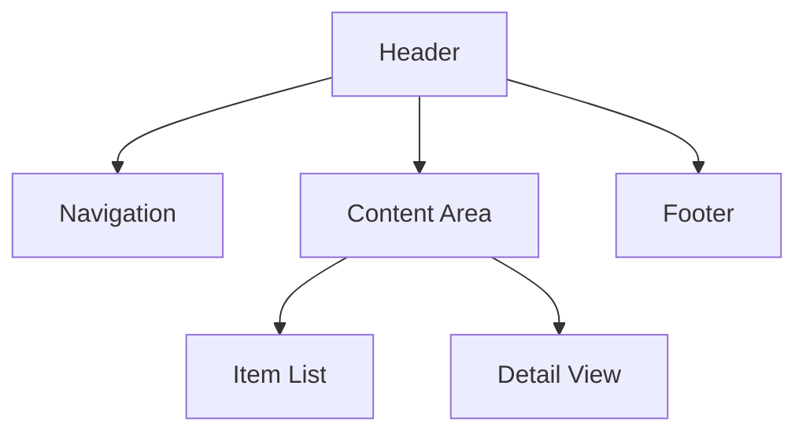

# TINS README Specification

## Overview

This document defines the formal specification for TINS README files. These files serve as the sole source of information for LLMs to generate functional software. Following this specification ensures that your README files contain all necessary information in a standardized format for optimal code generation.

## File Format

Each TINS README must be a valid Markdown (.md) file that follows this general structure:

```markdown
# Project Title

## Description
[General description of the software]

## Functionality
[Detailed functionality sections]

## Technical Implementation
[Technical details sections]

## [Additional Sections as needed]
```

## Required Sections

### 1. Project Title

The first line of the README must be a level 1 heading with the project name:

```markdown
# Project Name
```

### 2. Description

A concise overview of the software, explaining its purpose and key features:

```markdown
## Description

[1-3 paragraphs explaining what the software does and its primary use cases]
```

### 3. Functionality

Detailed explanation of user-facing features and behaviors:

```markdown
## Functionality

### Core Features
- [Feature 1]
- [Feature 2]
...

### User Interface
[Description of UI elements, layout, and components]

### Behavior Specifications
[Detailed explanation of how the software should behave in various scenarios]
```

### 4. Technical Implementation

Details on how the software should be implemented:

```markdown
## Technical Implementation

### Architecture
[Description of the software architecture, patterns, and organization]

### Data Structures
[Definitions of key data structures and their relationships]

### Algorithms
[Explanation of important algorithms and processes]
```

## Optional Sections

The following sections are recommended but not strictly required:

### Style Guide

```markdown
## Style Guide
[Visual design specifications, colors, typography, animations, etc.]
```

### Testing Scenarios

```markdown
## Testing Scenarios
[List of test cases that the implementation should satisfy]
```

### Accessibility Requirements

```markdown
## Accessibility Requirements
[Specifications for making the software accessible]
```

### Performance Goals

```markdown
## Performance Goals
[Metrics and targets for performance optimization]
```

### Extended Features

```markdown
## Extended Features
[Optional features that could enhance the software]
```

## Usage of Diagrams

Diagrams should be included using ASCII art, markdown tables, or Mermaid syntax to illustrate:
- UI layouts
- Architecture diagrams
- Data flow
- State machines

Example:

```markdown
### User Interface Layout


```

## Code Examples

Where appropriate, include example code snippets to illustrate expected behavior or data structures:

````markdown
```javascript
// Example data structure
{
  id: string,
  name: string,
  properties: {
    key1: value1,
    key2: value2
  }
}
```
````

## Metadata Tags

You can include special metadata tags to provide hints to the LLM:

```markdown
<!-- ZS:COMPLEXITY:MEDIUM -->
<!-- ZS:PRIORITY:HIGH -->
<!-- ZS:PLATFORM:WEB -->
<!-- ZS:LANGUAGE:JAVASCRIPT -->
```

## Validation Rules

To be considered valid, a TINS README must:

1. Include all required sections with appropriate content
2. Use proper Markdown formatting
3. Provide sufficient detail for implementation
4. Be self-consistent with no contradictory requirements
5. Not reference external sources or documentation
6. Be complete (all functionality must be described)

## Version Control

Each TINS README should include a version indicator:

```markdown
<!-- TINS Specification v1.0 -->
```

## Example README

See the [examples](../examples/) directory for complete examples of valid TINS READMEs.

## Extensions

The base specification can be extended with domain-specific requirements:

- **Web Applications**: Additional sections for routing, state management, API integration
- **Mobile Applications**: Platform-specific guidelines, native feature usage
- **Data Science**: Dataset descriptions, model specifications, evaluation metrics
- **Games**: Game mechanics, asset descriptions, level designs

## Compatibility

TINS READMEs should be:

1. Human-readable
2. Compatible with standard Markdown renderers
3. Optimized for LLM interpretation
4. Versioned in standard version control systems

## Schema

A formal JSON Schema for validating TINS READMEs is available in the tools directory.


================================================
FILE: examples/todo-app/README.md
================================================
# TINS Todo Application

## Description

A minimalist yet powerful todo list application built using the TINS methodology. It allows users to manage tasks with priorities, due dates, and categories while maintaining a clean and intuitive interface.

## Functionality

### Core Features

- Create, read, update, and delete todo items
- Mark tasks as complete/incomplete
- Set priority levels (Low, Medium, High)
- Add due dates to tasks
- Categorize tasks with custom categories
- Filter and sort tasks by various attributes
- Persistent storage of tasks
- Dark/light theme support

### User Interface

The interface should consist of:

```
+---------------------------------------------------+
| ✏️ My Todo List                      🌙 [Search] |
+---------------------------------------------------+
| âž• Add New Task                                   |
+---------------------------------------------------+
| Filters: All | Active | Completed                 |
| Sort: Date â–¼ | Priority | Alphabetical           |
+---------------------------------------------------+
| ☐ High | Buy groceries           | Today    | 🗑️  |
| ☑ Med  | Call dentist            | Yesterday| 🗑️  |
| ☐ Low  | Finish presentation     | Mar 15   | 🗑️  |
+---------------------------------------------------+
| Completed: 1 | Remaining: 2                       |
+---------------------------------------------------+
```

- Header with app name and theme toggle
- Search bar for filtering tasks
- Add new task button/form
- Filter and sort controls
- Task list with checkbox, priority indicator, task name, due date, and delete button
- Status bar showing task completion statistics

### Task Creation/Editing

When adding or editing a task, display a form with:
- Task name field (required)
- Priority selector (Low/Medium/High)
- Due date picker (optional)
- Category selector with option to create new categories
- Notes field for additional details (optional)
- Save and Cancel buttons

### Task Interaction

- Click on checkbox to toggle completion status
- Click on task name to edit task
- Swipe left (mobile) or hover and click delete icon to remove task
- Completed tasks should have a strikethrough style

## Technical Implementation

### Data Model

Each task should be represented as an object with:

```javascript
{
  id: string,           // Unique identifier
  title: string,        // Task name
  completed: boolean,   // Completion status
  priority: "low" | "medium" | "high",
  dueDate: Date | null, // Optional due date
  category: string | null, // Optional category
  notes: string | null, // Optional additional information
  createdAt: Date,      // Creation timestamp
  updatedAt: Date       // Last update timestamp
}
```

### Storage

- Use local storage for persistent data
- Implement data synchronization if offline capability required
- Store tasks in a structured format that allows efficient filtering/sorting

### State Management

- Maintain application state including:
  - Current tasks
  - Filter settings
  - Sort order
  - Current theme
  - Active modal/dialog state

### User Experience Considerations

1. Task Creation:
   - Quick add capability (just title) with default priority medium
   - Advanced add with all fields
   - Autocomplete for categories

2. Task Management:
   - Batch operations (delete multiple, mark multiple complete)
   - Drag-and-drop reordering
   - Keyboard shortcuts for common actions

3. Feedback:
   - Confirmation for task deletion
   - Undo capability for major actions
   - Visual feedback for completion (brief animation)
   - Due date approaching/overdue notifications

### Responsive Design

- Mobile-first approach
- Different layouts for:
  - Mobile: Single column, swipe actions, bottom navigation
  - Tablet: Two-column layout
  - Desktop: Multi-column with sidebar for filters/categories

## Accessibility Requirements

- High contrast mode
- Keyboard navigable interface
- Screen reader compatibility with proper ARIA attributes
- Focus management for forms and interactive elements
- Text scaling support

## Performance Goals

- Initial load under 2 seconds
- Smooth animations (60fps)
- Responsive to input with no perceptible lag
- Efficient handling of large task lists (1000+ items) without performance degradation

## Extended Features (Optional)

- Recurring tasks
- Subtasks/checklists within tasks
- Time estimates for tasks
- Tags for cross-category organization
- Task sharing/collaboration
- Data export/import
- Task statistics and productivity insights

## Implementation Notes

- Prioritize a clean, focused UI over feature bloat
- Ensure all interactive elements have appropriate hover/focus states
- Use consistent iconography throughout the application
- Implement proper error handling for all operations
- Optimize for both mouse and touch interactions
