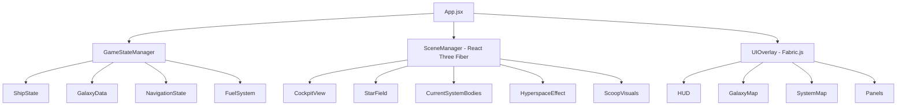

# REACT-DANGEROUS

## Description

REACT-DANGEROUS is a first-person 3D space simulation recreation of Elite Dangerous's Frameshift Drive (FSD) systems, galaxy navigation, and fuel mechanics. Built with React, React Three Fiber (three.js), drei helpers, and Fabric.js for 2D UI overlays, this authentic wireframe implementation focuses on accurately recreating the FSD hyperspace jump system, supercruise mechanics, 3D galaxy map navigation, system map exploration, and fuel scooping from specific stellar classes.

The application provides a fully functional cockpit view where players can navigate a procedurally positioned star system database, plot multi-jump routes through 3D space, manage fuel consumption with realistic exponential curves, engage frameshift drives for both in-system supercruise and hyperspace jumps, and scoop hydrogen fuel from main-sequence stars. All mechanics follow Elite Dangerous's authentic logic including mass-lock effects, heat management, and KGB FOAM scoopable star classification.

This is a development prototype using wireframe graphics and placeholder SVG UI elements to establish core functionality before final art production.

## Core Functionality

### 1. Frameshift Drive System

#### 1.1 Supercruise Mode
- **Activation**: Press and hold 'J' key for 0.5 seconds to engage supercruise within current star system
- **Speed Scaling**: Ship accelerates from 30 km/s up to 2000c (times speed of light) exponentially
- **Acceleration Formula**: `speed = baseSpeed * Math.pow(throttle, 2) * (1 - massLockFactor)`
- **Mass Lock Effect**:
  - Proximity to stars reduces max speed: `massLock = Math.max(0, 1 - (distance / safeDistance))`
  - Planets within 1000 km apply mass lock proportional to their mass
  - Other ships within 500m apply mass lock proportional to their mass
  - Stations apply 100% mass lock within 7.5 km
- **Disengage Time**: Time to drop from supercruise increases near massive bodies: `disengageTime = 4 + (massLock * 6)` seconds
- **Visual Feedback**: Blue tunnel effect with speed lines when active, cockpit displays "SUPERCRUISE" in cyan text

#### 1.2 Hyperspace Jump Mode
- **Activation**: Select target system in galaxy map, press 'J' to initiate jump
- **Charging**: 4-5 second charge sequence with blue spiral FSD charge animation visible from cockpit
- **Interruption**: Charge interrupted if:
  - Mass lock exceeds 50%
  - Hull integrity drops below 50%
  - FSD takes damage during charge
- **Fuel Consumption**: Calculated using `fuel = baseFuel * Math.pow(distance / maxRange, 2.5)` where:
  - `baseFuel` = 1.0 ton for base jump
  - `distance` = light-years to target
  - `maxRange` = maximum jump range based on FSD class and ship mass
- **Jump Sequence**:
  1. Blue charge effect builds for 4 seconds
  2. Screen fades to white
  3. Hyperspace tunnel animation (3 seconds) with blue/purple swirling vortex
  4. Emerge in front of target system's primary star
  5. Always drop at safe distance (20-50 Ls) from star surface

#### 1.3 Jump Range Calculation
- **Formula**: `maxJumpRange = optimalMass * Math.pow(fsdRating / shipMass, 1/powerConstant)`
- **FSD Rating Levels**: 1-5 (Rating 5 = longest range)
- **Ship Mass Components**:
  - Hull mass (fixed)
  - Cargo mass (variable)
  - Fuel mass (current fuel * 1 ton per unit)
  - Module mass (fixed)
- **Fuel Impact**: Each ton of fuel reduces jump range by ~0.3-0.5 LY
- **Display**: Real-time jump range shown in HUD as "RANGE: XX.XX LY"

### 2. 3D Galaxy Map Interface

#### 2.1 Navigation Controls
- **Activation**: Press 'M' key to open galaxy map
- **Camera Controls**:
  - Mouse drag: Rotate view around current focus point
  - Mouse wheel: Zoom in/out (0.1x to 1000x scale)
  - WASD keys: Pan camera in 3D space
  - Q/E keys: Roll camera view
  - Spacebar: Reset to current ship location
- **System Selection**:
  - Left-click any star: Select and display info panel
  - Double-click: Set as jump target
  - Right-click: Add to route waypoints

#### 2.2 Star System Database
- **System Properties**:
  ```javascript
  {
    id: "SOL-0001",
    name: "Sol",
    position: { x: 0, y: 0, z: 0 }, // Galactic coordinates in LY
    starClass: "G", // Main star classification
    population: 22780000000,
    economy: "Industrial",
    government: "Federation",
    allegiance: "Federation",
    stations: [
      { name: "Abraham Lincoln", type: "Orbis", services: ["refuel", "repair", "outfitting"] }
    ],
    bodies: [
      { name: "Sol", type: "star", class: "G", scoopable: true, mass: 1.0 },
      { name: "Mercury", type: "planet", orbit: 0.387 },
      // ... more bodies
    ]
  }
  ```

#### 2.3 Filter System
- **Star Class Filter**: Toggle visibility of K, G, B, F, O, A, M class stars
- **Scoopable Only**: Show only KGB FOAM stars (checkbox filter)
- **Economy Type**: Industrial, Agricultural, High-Tech, Extraction, Refinery, Military, Tourism, Colony
- **Government Type**: Democracy, Dictatorship, Federation, Empire, Alliance, Anarchy, Corporate
- **Population Range**: Slider from 0 to 10 billion+
- **Facilities Filter**: Has Refuel, Has Repair, Has Outfitting, Has Market, Has Shipyard
- **Filters Applied**: Visual badges on filtered stars (small colored icons)

#### 2.4 Route Plotting
- **Target Selection**: Click system, press "Set Target" button
- **Multi-Jump Routing**:
  - Algorithm: A* pathfinding using jump range as edge weight
  - Maximum route: 20,000 LY total distance
  - Waypoint system: Up to 50 waypoints
- **Route Types**:
  - **Fast Route**: Fewest jumps, uses maximum jump range
  - **Economical Route**: Minimizes fuel consumption, uses 50-70% jump range per hop
- **Route Visualization**:
  - Yellow line connecting plotted jumps
  - Green spheres at each waypoint
  - Red segments where fuel may be insufficient
  - Display: "15 JUMPS / 450.6 LY / FUEL: 8.5T"
- **Fuel Warnings**:
  - Orange alert if route requires >80% fuel capacity
  - Red alert if route impossible with current fuel
  - Suggest refuel/scoop stops if needed

#### 2.5 Visual Rendering
- **Star Rendering**:
  - Wireframe sphere for each star (radius scales with mass)
  - Color-coded by class: O=blue, B=blue-white, A=white, F=yellow-white, G=yellow, K=orange, M=red
  - Brightness scales with luminosity
  - Scoopable stars pulse gently
- **Jump Range Sphere**:
  - Green wireframe sphere centered on current position
  - Radius = current maximum jump range
  - Opacity 30%, visible when no target selected
- **Route Line**:
  - Yellow connected line segments
  - Each segment labeled with jump number
  - Dotted line for unconfirmed route extensions
- **System Names**:
  - Displayed on hover with distance from current position
  - Always-on labels for systems within 20 LY

### 3. System Map Interface

#### 3.1 Local System View
- **Activation**: Press 'N' key to open system map
- **Orbital Diagram**:
  - 2D top-down view of orbital plane
  - Concentric orbital paths shown as white circles
  - Bodies positioned along their orbits based on real-time orbital mechanics
  - Orbit speed: `velocity = sqrt(G * starMass / orbitRadius)`
- **Body Types**:
  - Stars: Bright center sphere with corona glow
  - Planets: Colored dots (rocky=brown, gas=tan, ice=blue)
  - Moons: Smaller dots orbiting planets
  - Stations: Square wireframe icons
  - Asteroid Belts: Dotted circular bands

#### 3.2 Body Information Panel
- **Displayed on Selection**:
  - Body name and type
  - Distance from ship (Ls = light-seconds)
  - Orbital period and radius
  - Surface gravity
  - For stations: Available services list
  - For stars: Class, scoopable status, temperature
- **Navigation**:
  - "Set Destination" button: Targets body for supercruise
  - "Plot Route" for stations: Calculates supercruise approach
  - Distance indicator updates in real-time as ship moves

#### 3.3 Orbital Mechanics
- **Real-Time Movement**: Bodies update position every frame: `angle += (2 * PI / orbitalPeriod) * deltaTime`
- **Accurate Distances**: Calculated in meters, displayed in Ls for large distances
- **Zoom Levels**: Auto-scale from inner system (show planets) to outer system (show distant bodies)

### 4. Fuel Scooping Mechanics

#### 4.1 Scoopable Star Classification
- **KGB FOAM Mnemonic**: Only these classes can be scooped
  - **K**: Orange main-sequence (heat multiplier: 0.7)
  - **G**: Yellow main-sequence (heat multiplier: 0.8)
  - **B**: Blue-white main-sequence (heat multiplier: 1.3)
  - **F**: White main-sequence (heat multiplier: 0.9)
  - **O**: Blue main-sequence (heat multiplier: 1.5)
  - **A**: White main-sequence (heat multiplier: 1.0)
  - **M**: Red dwarf (heat multiplier: 0.5)
- **Non-Scoopable**: Brown dwarfs (L, T, Y), white dwarfs, neutron stars, black holes
- **Visual Indicator**: Scoopable stars show orange glow band at scoop range

#### 4.2 Scoop Module System
- **Requirement**: Fuel scoop module must be installed in optional internal slot
- **Scoop Ratings**: A (best) to E (worst)
  - A-rated: 878 kg/s max scoop rate
  - B-rated: 720 kg/s
  - C-rated: 534 kg/s
  - D-rated: 378 kg/s
  - E-rated: 245 kg/s
- **Installation**: Player must have scoop equipped (checked in ship loadout state)

#### 4.3 Scooping Process
- **Activation**:
  1. Approach scoopable star in supercruise
  2. Enter scoop zone (distance < star radius + 2000 km)
  3. Scoop automatically activates if equipped
- **Scoop Rate Calculation**:
  ```javascript
  scoopRate = baseScoopRate * proximityFactor * angleFactor
  proximityFactor = Math.min(1.0, (maxRange - distance) / maxRange)
  angleFactor = Math.abs(Math.cos(approachAngle)) // 0° = maximum
  ```
- **Optimal Scooping**:
  - Distance: 50-70% into scoop zone
  - Approach angle: 0-15° (head-on)
  - Speed: Below 200 km/s for stability
  - Heat: Maintain 65-75% for balance

#### 4.4 Heat Management
- **Heat Generation**:
  ```javascript
  heatGain = scoopRate * starHeatMultiplier * (1 - distance/safeDistance)
  heatDissipation = shipCoolingRate * (currentHeat / 100)
  currentHeat += (heatGain - heatDissipation) * deltaTime
  ```
- **Heat Levels**:
  - 0-60%: Safe (green indicator)
  - 60-90%: Warning (yellow indicator, warning beep every 2 seconds)
  - 90-100%: Critical (orange indicator, rapid beeping)
  - 100-120%: Module damage (red indicator, alarm sound)
  - 120-150%: Hull damage at 1% per second
  - 150%+: Catastrophic damage, ship destruction at 200%
- **Cooling**:
  - Exit scoop zone: Heat drops at `coolingRate = 5% per second`
  - Deploy heat sinks: Instant -30% heat (limited consumable)
  - Adjust approach angle to 45°+: Reduces heat gain by 50%

#### 4.5 Fuel Tank Management
- **Tank Capacity**: Stored in ship state as `fuelCapacity` (tons)
- **Current Fuel**: `currentFuel` updates every frame during scoop
- **Scoop UI Display**:
  - Fuel bar: Visual representation (0-100%)
  - Scoop rate: "SCOOPING: 0.45T/S"
  - Tank status: "FUEL: 12.5 / 16.0 T"
  - Heat bar: Percentage with color coding
- **Auto-Stop**: Scooping automatically stops when `currentFuel >= fuelCapacity`

#### 4.6 Binary Star Handling
- **Primary Star Only**: In binary/trinary systems, only the arrival star (primary) can be scooped
- **Detection**: System map shows "PRIMARY STAR" label
- **Restriction**: Attempting to scoop secondary stars shows "INCOMPATIBLE STAR" message

### 5. HUD and Cockpit Interface

#### 5.1 Main HUD Elements (Fabric.js 2D Overlay)
- **Central Reticle**: Cross-hair with velocity vector indicator
- **Compass Ring**: 360° heading with cardinal directions
- **Radar Display**: 2D radar showing nearby bodies and ships (bottom center)
- **Speed Indicator**: Left side, shows current speed in km/s or c
- **Fuel Gauge**: Right side vertical bar with numeric display
- **Heat Gauge**: Right side below fuel, color-coded bar
- **Target Info Panel**: Top left, shows selected target info
- **Status Messages**: Bottom center, scrolling text for warnings/confirmations

#### 5.2 Holographic Panels (Fabric.js SVG)
- **Left Panel - Navigation**:
  - Target system name
  - Distance to target
  - Jump range remaining
  - Next waypoint in route
- **Right Panel - Ship Status**:
  - FSD status (Ready, Charging, Cooldown)
  - Mass lock indicator
  - Fuel scoop status
  - Heat percentage
- **Top Panel - System Info**:
  - Current system name
  - Body count
  - Population
  - Controlling faction

#### 5.3 Warning Systems
- **Audio Alerts**:
  - FSD charge: Low hum building to high-pitched whine
  - Mass lock: Warning beep (repeating every 2 seconds)
  - Overheat: Alarm siren (faster as heat increases)
  - Fuel low (< 10%): Female voice "Fuel level critical"
  - Fuel scoop active: Soft humming tone
- **Visual Warnings**:
  - Orange flashing border for caution states
  - Red flashing border for critical states
  - Text warnings in center-bottom of screen

## Technical Implementation

### Architecture Overview



### Component Structure

#### Core Components

**1. App.jsx** (Main Application)
```javascript
import React, { useState, useEffect } from 'react';
import { Canvas } from '@react-three/fiber';
import { Stage } from 'fabric';
import GameStateManager from './managers/GameStateManager';
import SceneManager from './components/SceneManager';
import UIOverlay from './components/UIOverlay';

function App() {
  const [gameState, setGameState] = useState({
    ship: initialShipState,
    galaxy: galaxyData,
    navigation: navigationState,
    activeView: 'cockpit' // 'cockpit', 'galaxyMap', 'systemMap'
  });
  
  // Main game loop runs at 60 FPS
  useEffect(() => {
    const gameLoop = setInterval(() => {
      updateGameState();
    }, 1000 / 60);
    return () => clearInterval(gameLoop);
  }, []);
  
  return (
    <div style={{ width: '100vw', height: '100vh', background: '#000' }}>
      <Canvas camera={{ fov: 75, position: [0, 0, 5] }}>
        <SceneManager gameState={gameState} />
      </Canvas>
      <UIOverlay gameState={gameState} setGameState={setGameState} />
    </div>
  );
}
```

**2. GameStateManager.js** (State Management)
```javascript
class GameStateManager {
  constructor() {
    this.state = {
      ship: {
        position: { x: 0, y: 0, z: 0 },
        rotation: { pitch: 0, yaw: 0, roll: 0 },
        velocity: 0,
        currentSystem: "Sol",
        currentFuel: 16.0,
        maxFuel: 16.0,
        heat: 0,
        mass: 420, // tons
        fsdRating: 5,
        fsdCharge: 0,
        fsdMode: 'idle', // 'idle', 'supercruise', 'charging', 'jumping'
        hasFuelScoop: true,
        scoopRating: 'A',
        massLock: 0
      },
      currentSystem: {
        name: "Sol",
        position: { x: 0, y: 0, z: 0 },
        bodies: [] // populated from database
      },
      navigation: {
        targetSystem: null,
        route: [],
        routeType: 'fast'
      },
      scooping: {
        active: false,
        rate: 0,
        targetStar: null
      }
    };
  }
  
  update(deltaTime) {
    this.updateFSD(deltaTime);
    this.updateHeat(deltaTime);
    this.updateScooping(deltaTime);
    this.updateMassLock();
  }
  
  updateFSD(deltaTime) {
    // Implement FSD logic
  }
  
  calculateJumpRange() {
    const optimalMass = 300; // FSD-specific constant
    const powerConstant = 2.5;
    const shipMass = this.state.ship.mass + this.state.ship.currentFuel;
    return optimalMass * Math.pow(this.state.ship.fsdRating / shipMass, 1 / powerConstant);
  }
  
  calculateFuelConsumption(distance) {
    const baseFuel = 1.0;
    const maxRange = this.calculateJumpRange();
    return baseFuel * Math.pow(distance / maxRange, 2.5);
  }
}
```

**3. SceneManager.jsx** (Three.js Scene)
```javascript
import { useFrame, useThree } from '@react-three/fiber';
import { OrbitControls, Stars } from '@react-three/drei';
import CockpitView from './CockpitView';
import StarField from './StarField';
import HyperspaceEffect from './HyperspaceEffect';

function SceneManager({ gameState }) {
  const { camera } = useThree();
  
  useFrame((state, delta) => {
    // Update camera based on ship movement
    if (gameState.activeView === 'cockpit') {
      camera.position.set(0, 0, 0);
      camera.rotation.set(
        gameState.ship.rotation.pitch,
        gameState.ship.rotation.yaw,
        gameState.ship.rotation.roll
      );
    }
  });
  
  return (
    <>
      <ambientLight intensity={0.1} />
      {gameState.activeView === 'cockpit' && (
        <>
          <CockpitView />
          <StarField />
          {gameState.currentSystem.bodies.map(body => (
            <CelestialBody key={body.name} data={body} />
          ))}
        </>
      )}
      {gameState.ship.fsdMode === 'jumping' && <HyperspaceEffect />}
    </>
  );
}
```

**4. UIOverlay.jsx** (Fabric.js Canvas Overlay)
```javascript
import { useEffect, useRef } from 'react';
import { Canvas as FabricCanvas, Rect, Text, Line } from 'fabric';

function UIOverlay({ gameState, setGameState }) {
  const canvasRef = useRef(null);
  const fabricCanvas = useRef(null);
  
  useEffect(() => {
    fabricCanvas.current = new FabricCanvas(canvasRef.current, {
      width: window.innerWidth,
      height: window.innerHeight,
      selection: false
    });
    
    renderHUD();
    
    return () => fabricCanvas.current.dispose();
  }, []);
  
  useEffect(() => {
    renderHUD();
  }, [gameState]);
  
  function renderHUD() {
    fabricCanvas.current.clear();
    
    // Central reticle
    const reticle = new Line([
      window.innerWidth / 2 - 20, window.innerHeight / 2,
      window.innerWidth / 2 + 20, window.innerHeight / 2
    ], {
      stroke: '#00FF00',
      strokeWidth: 2,
      selectable: false
    });
    fabricCanvas.current.add(reticle);
    
    // Speed indicator
    const speedText = new Text(`${gameState.ship.velocity.toFixed(2)} km/s`, {
      left: 50,
      top: window.innerHeight - 100,
      fill: '#00FFFF',
      fontSize: 24,
      fontFamily: 'monospace',
      selectable: false
    });
    fabricCanvas.current.add(speedText);
    
    // Fuel gauge
    const fuelBar = new Rect({
      left: window.innerWidth - 70,
      top: 100,
      width: 30,
      height: 200,
      fill: 'transparent',
      stroke: '#FFFFFF',
      strokeWidth: 2,
      selectable: false
    });
    
    const fuelFill = new Rect({
      left: window.innerWidth - 70,
      top: 100 + (200 * (1 - gameState.ship.currentFuel / gameState.ship.maxFuel)),
      width: 30,
      height: 200 * (gameState.ship.currentFuel / gameState.ship.maxFuel),
      fill: gameState.ship.currentFuel < 2 ? '#FF0000' : '#00FF00',
      selectable: false
    });
    
    fabricCanvas.current.add(fuelBar, fuelFill);
    
    fabricCanvas.current.renderAll();
  }
  
  return (
    <canvas
      ref={canvasRef}
      style={{
        position: 'absolute',
        top: 0,
        left: 0,
        pointerEvents: gameState.activeView === 'cockpit' ? 'none' : 'auto'
      }}
    />
  );
}
```

### Data Structures

#### Star System Data Model
```javascript
const starSystemSchema = {
  id: String, // Unique identifier "SOL-0001"
  name: String, // "Sol"
  position: {
    x: Number, // Galactic X coordinate in light-years
    y: Number, // Galactic Y coordinate
    z: Number  // Galactic Z coordinate
  },
  starClass: String, // "G", "K", "M", etc.
  mainStar: {
    class: String, // Full classification "G2V"
    scoopable: Boolean,
    mass: Number, // Solar masses
    temperature: Number, // Kelvin
    radius: Number // Solar radii
  },
  population: Number,
  economy: String,
  government: String,
  allegiance: String,
  stations: [{
    name: String,
    type: String, // "Orbis", "Coriolis", "Ocellus"
    orbitBody: String, // Planet it orbits
    services: [String] // ["refuel", "repair", "outfitting"]
  }],
  bodies: [{
    name: String,
    type: String, // "star", "planet", "moon"
    class: String, // For stars: "G", planets: "Rocky", "Gas Giant"
    scoopable: Boolean, // Stars only
    mass: Number,
    radius: Number,
    orbitRadius: Number, // AU
    orbitPeriod: Number, // Days
    currentAngle: Number // Radians, for position calculation
  }]
};
```

#### Ship State Schema
```javascript
const shipStateSchema = {
  // Position and movement
  position: { x: Number, y: Number, z: Number }, // Meters
  rotation: { pitch: Number, yaw: Number, roll: Number }, // Radians
  velocity: Number, // m/s
  throttle: Number, // 0.0 to 1.0
  
  // Location
  currentSystem: String, // System ID
  currentBody: String, // Nearest body name
  
  // Fuel system
  currentFuel: Number, // Tons
  maxFuel: Number, // Tons
  fuelConsumptionRate: Number, // Tons per second
  
  // Heat system
  heat: Number, // Percentage 0-200
  coolingRate: Number, // % per second
  
  // FSD
  fsdRating: Number, // 1-5
  fsdClass: Number, // Size class
  fsdOptimalMass: Number, // Tons
  fsdCharge: Number, // 0-100%
  fsdMode: String, // 'idle', 'supercruise', 'charging', 'jumping', 'cooldown'
  fsdCooldown: Number, // Seconds remaining
  
  // Mass calculations
  hullMass: Number, // Tons
  cargoMass: Number, // Tons
  moduleMass: Number, // Tons
  totalMass: Number, // Calculated total
  
  // Equipment
  hasFuelScoop: Boolean,
  scoopRating: String, // 'A' through 'E'
  scoopRate: Number, // kg/s max capacity
  
  // Physics
  massLock: Number, // 0.0 to 1.0
  massLockSource: String, // What's causing mass lock
  
  // Jump history
  lastJumpTime: Number, // Timestamp
  jumpsRemaining: Number // Fuel-based estimate
};
```

#### Navigation State Schema
```javascript
const navigationStateSchema = {
  targetSystem: {
    id: String,
    name: String,
    position: { x: Number, y: Number, z: Number },
    distance: Number // From current position in LY
  },
  
  route: [{
    systemId: String,
    systemName: String,
    position: { x: Number, y: Number, z: Number },
    jumpDistance: Number, // From previous waypoint
    fuelRequired: Number, // Tons
    canReach: Boolean // Based on current fuel
  }],
  
  routeType: String, // 'fast' or 'economical'
  totalDistance: Number, // Light-years
  totalJumps: Number,
  totalFuelRequired: Number,
  
  currentWaypoint: Number, // Index in route array
  
  // Supercruise navigation
  supercruiseTarget: {
    bodyName: String,
    distance: Number, // Light-seconds
    eta: Number // Seconds
  }
};
```

### Key Algorithms

#### 1. A* Route Finding
```javascript
function findRoute(startSystem, targetSystem, galaxyData, shipState, routeType) {
  const openSet = [startSystem];
  const cameFrom = new Map();
  const gScore = new Map([[startSystem.id, 0]]);
  const fScore = new Map([[startSystem.id, calculateHeuristic(startSystem, targetSystem)]]);
  
  while (openSet.length > 0) {
    const current = openSet.reduce((min, sys) => 
      fScore.get(sys.id) < fScore.get(min.id) ? sys : min
    );
    
    if (current.id === targetSystem.id) {
      return reconstructPath(cameFrom, current);
    }
    
    openSet.splice(openSet.indexOf(current), 1);
    
    const neighbors = getSystemsInRange(current, shipState, galaxyData);
    
    for (const neighbor of neighbors) {
      const jumpDistance = calculateDistance(current.position, neighbor.position);
      const fuelCost = calculateFuelConsumption(jumpDistance, shipState);
      
      let tentativeGScore = gScore.get(current.id);
      
      if (routeType === 'fast') {
        tentativeGScore += 1; // Minimize jump count
      } else { // economical
        tentativeGScore += fuelCost; // Minimize fuel use
      }
      
      if (!gScore.has(neighbor.id) || tentativeGScore < gScore.get(neighbor.id)) {
        cameFrom.set(neighbor.id, current);
        gScore.set(neighbor.id, tentativeGScore);
        fScore.set(neighbor.id, tentativeGScore + calculateHeuristic(neighbor, targetSystem));
        
        if (!openSet.includes(neighbor)) {
          openSet.push(neighbor);
        }
      }
    }
  }
  
  return null; // No route found
}

function calculateHeuristic(systemA, systemB) {
  return calculateDistance(systemA.position, systemB.position);
}

function calculateDistance(posA, posB) {
  return Math.sqrt(
    Math.pow(posB.x - posA.x, 2) +
    Math.pow(posB.y - posA.y, 2) +
    Math.pow(posB.z - posA.z, 2)
  );
}
```

#### 2. Fuel Scoop Heat Management
```javascript
function updateScooping(deltaTime, shipState, currentStar) {
  if (!shipState.hasFuelScoop || !currentStar.scoopable) {
    return { scooping: false, rate: 0, heat: shipState.heat };
  }
  
  const distance = calculateDistance(shipState.position, currentStar.position);
  const scoopZoneRadius = currentStar.radius + 2000000; // +2000 km
  
  if (distance > scoopZoneRadius) {
    return { scooping: false, rate: 0, heat: shipState.heat };
  }
  
  // Calculate scoop efficiency
  const proximityFactor = Math.min(1.0, (scoopZoneRadius - distance) / scoopZoneRadius);
  const velocityVector = calculateVelocityVector(shipState);
  const starVector = normalizeVector(subtract(currentStar.position, shipState.position));
  const approachAngle = Math.acos(dotProduct(velocityVector, starVector));
  const angleFactor = Math.abs(Math.cos(approachAngle));
  
  const baseScoopRate = getScoopRateForRating(shipState.scoopRating); // kg/s
  const actualScoopRate = baseScoopRate * proximityFactor * angleFactor;
  
  // Heat generation
  const starHeatMultiplier = getStarHeatMultiplier(currentStar.class);
  const heatGain = (actualScoopRate / 1000) * starHeatMultiplier * (1 - distance / scoopZoneRadius) * 100;
  const heatDissipation = 5 * (shipState.heat / 100);
  
  const newHeat = Math.max(0, Math.min(200, shipState.heat + (heatGain - heatDissipation) * deltaTime));
  
  // Update fuel
  const fuelGained = (actualScoopRate / 1000) * deltaTime; // Convert kg to tons
  const newFuel = Math.min(shipState.maxFuel, shipState.currentFuel + fuelGained);
  
  return {
    scooping: true,
    rate: actualScoopRate,
    heat: newHeat,
    fuel: newFuel
  };
}

function getScoopRateForRating(rating) {
  const rates = {
    'A': 878,
    'B': 720,
    'C': 534,
    'D': 378,
    'E': 245
  };
  return rates[rating] || 0;
}

function getStarHeatMultiplier(starClass) {
  const multipliers = {
    'O': 1.5,
    'B': 1.3,
    'A': 1.0,
    'F': 0.9,
    'G': 0.8,
    'K': 0.7,
    'M': 0.5
  };
  return multipliers[starClass] || 1.0;
}
```

#### 3. Mass Lock Calculation
```javascript
function calculateMassLock(shipState, systemBodies) {
  let maxMassLock = 0;
  let massLockSource = null;
  
  for (const body of systemBodies) {
    const distance = calculateDistance(shipState.position, body.position);
    let massLock = 0;
    let safeDistance = 0;
    
    if (body.type === 'star') {
      safeDistance = body.radius * 5; // Safe distance is 5x star radius
      if (distance < safeDistance) {
        massLock = 1 - (distance / safeDistance);
      }
    } else if (body.type === 'planet') {
      safeDistance = body.radius * 10;
      if (distance < 1000000) { // 1000 km
        massLock = (body.mass / 100) * (1 - distance / 1000000);
      }
    } else if (body.type === 'station') {
      if (distance < 7500) { // 7.5 km
        massLock = 1.0; // Full mass lock
      }
    }
    
    if (massLock > maxMassLock) {
      maxMassLock = massLock;
      massLockSource = body.name;
    }
  }
  
  return {
    massLock: Math.min(1.0, maxMassLock),
    source: massLockSource
  };
}
```

#### 4. Supercruise Speed Calculation
```javascript
function calculateSupercruiseSpeed(shipState, massLock, throttle, deltaTime) {
  const baseSpeed = 30000; // 30 km/s minimum
  const maxSpeedMultiplier = 2000; // 2000c maximum
  const c = 299792458; // Speed of light in m/s
  
  // Throttle affects acceleration exponentially
  const throttleFactor = Math.pow(throttle, 2);
  
  // Mass lock reduces max speed
  const massLockPenalty = 1 - massLock;
  
  // Target speed
  const targetSpeed = baseSpeed * maxSpeedMultiplier * c * throttleFactor * massLockPenalty;
  
  // Smooth acceleration/deceleration
  const acceleration = 100000; // m/s²
  const speedDelta = acceleration * deltaTime;
  
  let newSpeed = shipState.velocity;
  if (targetSpeed > shipState.velocity) {
    newSpeed = Math.min(targetSpeed, shipState.velocity + speedDelta);
  } else {
    newSpeed = Math.max(targetSpeed, shipState.velocity - speedDelta * 2); // Faster deceleration
  }
  
  return newSpeed;
}
```

### Input Handling

```javascript
const keyBindings = {
  // FSD controls
  'j': 'engageFSD', // Hold for supercruise, tap for jump if target set
  'h': 'hyperspaceJump', // Explicit hyperspace jump
  
  // Map controls
  'm': 'toggleGalaxyMap',
  'n': 'toggleSystemMap',
  
  // Navigation
  't': 'selectTarget', // Select target under cursor
  'y': 'nextRouteWaypoint',
  
  // Ship controls (for supercruise)
  'w': 'throttleUp',
  's': 'throttleDown',
  'a': 'yawLeft',
  'd': 'yawRight',
  'q': 'rollLeft',
  'e': 'rollRight',
  'r': 'pitchUp',
  'f': 'pitchDown',
  
  // Utility
  'x': 'throttleZero',
  'tab': 'targetNextBody',
  'backspace': 'clearTarget',
  'escape': 'closeAllPanels'
};

function handleKeyPress(event, gameState, setGameState) {
  const action = keyBindings[event.key.toLowerCase()];
  
  if (!action) return;
  
  switch (action) {
    case 'engageFSD':
      if (gameState.navigation.targetSystem && gameState.ship.fsdMode === 'idle') {
        initiateHyperspaceJump(gameState, setGameState);
      } else if (gameState.ship.fsdMode === 'idle') {
        engageSupercruise(gameState, setGameState);
      }
      break;
      
    case 'toggleGalaxyMap':
      setGameState({
        ...gameState,
        activeView: gameState.activeView === 'galaxyMap' ? 'cockpit' : 'galaxyMap'
      });
      break;
      
    // ... other cases
  }
}
```

### Three.js Wireframe Rendering

```javascript
// StarField.jsx - Background stars
function StarField() {
  const starsRef = useRef();
  
  const starPositions = useMemo(() => {
    const positions = new Float32Array(10000 * 3);
    for (let i = 0; i < 10000; i++) {
      positions[i * 3] = (Math.random() - 0.5) * 10000;
      positions[i * 3 + 1] = (Math.random() - 0.5) * 10000;
      positions[i * 3 + 2] = (Math.random() - 0.5) * 10000;
    }
    return positions;
  }, []);
  
  return (
    <points ref={starsRef}>
      <bufferGeometry>
        <bufferAttribute
          attach="attributes-position"
          count={starPositions.length / 3}
          array={starPositions}
          itemSize={3}
        />
      </bufferGeometry>
      <pointsMaterial size={2} color="#FFFFFF" />
    </points>
  );
}

// WireframeSphere.jsx - For stars and planets
function WireframeSphere({ position, radius, color, opacity = 1 }) {
  return (
    <mesh position={position}>
      <sphereGeometry args={[radius, 16, 16]} />
      <meshBasicMaterial
        color={color}
        wireframe={true}
        transparent={opacity < 1}
        opacity={opacity}
      />
    </mesh>
  );
}

// ScoopZone.jsx - Visual indicator for fuel scooping
function ScoopZone({ star, active }) {
  const ringRef = useRef();
  
  useFrame(() => {
    if (ringRef.current && active) {
      ringRef.current.rotation.z += 0.01;
    }
  });
  
  if (!star.scoopable) return null;
  
  const scoopRadius = star.radius + 2000;
  
  return (
    <mesh position={[star.position.x, star.position.y, star.position.z]} ref={ringRef}>
      <torusGeometry args={[scoopRadius, scoopRadius * 0.1, 16, 32]} />
      <meshBasicMaterial
        color={active ? "#FF8800" : "#FFAA00"}
        wireframe={true}
        transparent={true}
        opacity={active ? 0.8 : 0.3}
      />
    </mesh>
  );
}
```

## Style Guide

### Visual Design Specifications

#### Color Palette
- **Primary HUD**: Cyan (#00FFFF) for main interface elements
- **Warnings**: Yellow/Orange (#FFAA00) for caution states
- **Critical**: Red (#FF0000) for danger/damage states
- **Success**: Green (#00FF00) for confirmations and safe states
- **Text**: White (#FFFFFF) for readability
- **Background**: Pure black (#000000) for space
- **Star Colors**:
  - O: #9BB0FF (blue)
  - B: #AABFFF (blue-white)
  - A: #CAD7FF (white)
  - F: #F8F7FF (yellow-white)
  - G: #FFF4EA (yellow)
  - K: #FFD2A1 (orange)
  - M: #FFCC6F (red)

#### Typography
- **Font Family**: 'Courier New', 'Consolas', or 'Monaco' (monospace)
- **HUD Text Size**: 18-24px for primary readouts
- **Panel Headers**: 28px bold
- **Warning Text**: 32px bold with flashing animation
- **Distance/Numeric Readouts**: Tabular numbers for alignment

#### Animation Timings
- **FSD Charge**: 4 seconds linear progression
- **Hyperspace Tunnel**: 3 seconds with acceleration curve
- **Heat Warning Flash**: 0.5s on, 0.5s off (critical: 0.2s on/off)
- **Map Transitions**: 0.3s ease-in-out
- **Panel Slide-In**: 0.4s cubic-bezier(0.4, 0.0, 0.2, 1)

### Wireframe Aesthetic
- All 3D models use wireframe rendering with no solid fills
- Line thickness: 1-2px for readability
- Vertex density: 16x16 segments for spheres (balance detail vs performance)
- Glowing edges for active/selected objects using emissive material properties
- Depth fade: Objects further from camera reduce opacity linearly

### Placeholder SVG Graphics
- Simple geometric shapes for UI icons
- Icons: 32x32px base size
- Line art style matching wireframe 3D aesthetic
- Station icons: Square with internal cross
- Planet icons: Circle with equator line
- Star icons: Circle with radiating lines (8 points)

## Testing Scenarios

### Test Case 1: Basic Jump Sequence
1. Start in Sol system with 16T fuel
2. Open galaxy map (M key)
3. Select Alpha Centauri (4.37 LY away)
4. Verify jump range display shows reachable
5. Set as target
6. Return to cockpit
7. Press J to initiate jump
8. Verify FSD charge sequence (4 seconds)
9. Verify fuel consumption (~0.8T for this distance)
10. Verify arrival in front of Alpha Centauri's main star
11. Verify HUD updates with new system name

**Expected Result**: Smooth transition through hyperspace, correct fuel deduction, proper arrival position

### Test Case 2: Multi-Jump Route
1. Start in Sol
2. Plot route to Sag A* (25,000 LY away)
3. Verify route calculates with fuel stops required
4. Verify warning if no scoopable stars in route
5. Execute first jump
6. Verify route updates to show next waypoint
7. Test both "fast" and "economical" route types
8. Verify economical uses less fuel per jump

**Expected Result**: Route correctly plans fuel stops, warns about fuel limitations

### Test Case 3: Fuel Scooping - Normal
1. Jump to system with G-class star
2. Approach star in supercruise
3. Enter scoop zone (orange ring visible)
4. Verify "SCOOPING" indicator appears
5. Verify fuel gauge increases
6. Verify heat increases gradually
7. Maintain distance to keep heat at 70%
8. Fill tank completely
9. Verify scoop auto-stops at full tank

**Expected Result**: Smooth fuel gain, manageable heat, visual feedback clear

### Test Case 4: Fuel Scooping - Overheat
1. Scoop from O-class star (high heat)
2. Approach too close to star
3. Verify heat increases rapidly
4. Verify yellow warning at 90%
5. Verify red critical warning at 100%
6. Verify module damage warnings at 120%
7. Pull away to cool down
8. Verify heat dissipation rate

**Expected Result**: Clear warning progression, damage only if ignored

### Test Case 5: Mass Lock Prevention
1. Engage supercruise
2. Fly near a station
3. Try to engage FSD for jump
4. Verify "MASS LOCK DETECTED" warning
5. Verify jump charge interrupted
6. Fly away from station
7. Retry jump successfully

**Expected Result**: Mass lock prevents premature jumps, clear messaging

### Test Case 6: Galaxy Map Navigation
1. Open galaxy map
2. Test 3D rotation with mouse
3. Test zoom in/out with wheel
4. Test WASD panning
5. Filter for only K-class stars
6. Verify display updates correctly
7. Click a star, verify info panel
8. Test jump range sphere visibility

**Expected Result**: Smooth navigation, accurate filtering, clear visual feedback

### Test Case 7: Route Fuel Shortage
1. Start with 4T fuel
2. Plot route requiring 6T
3. Verify red warning appears
4. Verify "INSUFFICIENT FUEL" message
5. Add scoopable star waypoint manually
6. Verify route becomes valid

**Expected Result**: Clear fuel warnings, prevents impossible routes

### Test Case 8: Non-Scoopable Star Handling
1. Jump to system with white dwarf
2. Attempt to scoop
3. Verify "INCOMPATIBLE STAR TYPE" message
4. Verify no fuel gain
5. Verify heat still increases from proximity

**Expected Result**: Clear messaging, no false scooping indication

## Accessibility Requirements

### Keyboard Navigation
- All map functions accessible via keyboard
- Tab navigation through UI elements
- Enter/Space to activate buttons
- Arrow keys for fine control in maps
- Escape to close panels

### Visual Accessibility
- Minimum contrast ratio 7:1 for all text
- Color-blind safe palette (cyan/orange/red distinguishable)
- Option to enable text labels over all icons
- Scalable UI elements (support 150% zoom)
- Alternative to color-only indicators (shapes + colors)

### Audio Cues
- Distinct sounds for each warning type
- Voice confirmation of major actions
- Spatial audio for nearby objects
- Volume controls for effects/music/voice separately

### Performance Requirements
- Maintain 60 FPS on mid-range hardware
- Graceful degradation for lower-end systems
- Reduce wireframe density on performance mode
- Option to disable non-essential visual effects

## Edge Cases and Error Handling

### Edge Case 1: Zero Fuel During Jump
- **Scenario**: Fuel drops to 0 mid-jump sequence
- **Handling**: Emergency abort, drop from hyperspace at midpoint system
- **User Feedback**: "EMERGENCY ABORT - FUEL DEPLETED" message
- **Recovery**: Remain in emergency system, call fuel rats notification

### Edge Case 2: Heat Damage During Scoop
- **Scenario**: Heat exceeds 150% while scooping
- **Handling**: 
  - FSD takes damage, reduces max jump range by 10%
  - Hull integrity decreases 1% per second
  - Auto-eject from scoop zone at 180% heat
- **User Feedback**: Alarm sound, red flashing, "EMERGENCY HEAT LEVEL" text
- **Recovery**: Repair at station required to restore FSD range

### Edge Case 3: Route Through Non-Scoopable Region
- **Scenario**: Plotted route has 10+ jumps with no scoopable stars
- **Handling**: 
  - Calculate exact fuel requirement
  - Display warning if fuel insufficient
  - Suggest alternative route with scoop stops
- **User Feedback**: Orange warning icon on route line, "FUEL WARNING" panel
- **Prevention**: Route planner checks for scoopable stars every 3 jumps

### Edge Case 4: Binary Star Confusion
- **Scenario**: System has two stars, player tries to scoop secondary
- **Handling**:
  - Only primary star (arrival star) is scoopable
  - Display "SECONDARY STAR - NO SCOOP" message
- **User Feedback**: Scoop zone only renders on primary star
- **Clarity**: System map labels primary with "ARRIVAL STAR" tag

### Edge Case 5: Interrupted Jump Charge
- **Scenario**: Ship takes damage during FSD charge
- **Handling**:
  - Charge resets to 0
  - Enter 10-second FSD cooldown
  - Display "FSD INTERRUPTED" message
- **User Feedback**: Charge bar resets with red flash
- **Recovery**: Must wait for cooldown before retry

### Edge Case 6: Map Performance with Thousands of Stars
- **Scenario**: Galaxy map showing dense cluster region
- **Handling**:
  - Level-of-detail system: Only render closest 1000 stars
  - Distant stars shown as point cloud
  - Progressive loading as user pans
- **User Feedback**: Smooth performance maintained
- **Optimization**: Octree spatial partitioning for star lookup

### Edge Case 7: Negative Fuel Display
- **Scenario**: Rounding errors could cause -0.01T fuel display
- **Handling**: `Math.max(0, fuelValue)` on all fuel displays
- **Prevention**: Use integer fuel in tenths (160 = 16.0T) for calculations
- **Display**: Always show exactly 1 decimal place

### Edge Case 8: Supercruise Collision
- **Scenario**: Player flies into planet while in supercruise
- **Handling**:
  - Auto-disengage at 1000 km from surface
  - Apply emergency stop (velocity to 30 km/s)
  - Display "EMERGENCY DROP" message
- **User Feedback**: Screen shake effect, alarm sound
- **Safety**: Prevent actual collision damage in supercruise mode

## Performance Goals

### Frame Rate Targets
- **Minimum**: 30 FPS on low-end hardware (2017-era integrated graphics)
- **Target**: 60 FPS on mid-range hardware (2020-era dedicated GPU)
- **Optimal**: 120 FPS on high-end hardware with V-sync option

### Memory Budget
- **JavaScript Heap**: < 512 MB for game state and UI
- **WebGL Textures**: < 256 MB for all graphics (wireframe uses minimal textures)
- **Star Database**: < 100 MB for 100,000 star systems (compressed JSON)

### Loading Times
- **Initial Load**: < 5 seconds to cockpit view
- **Galaxy Map Open**: < 0.5 seconds
- **System Map Open**: < 0.3 seconds
- **Jump Sequence**: Consistent timing (7 seconds total) regardless of system load

### Optimization Strategies
- **Frustum Culling**: Only render stars/bodies in camera view
- **LOD System**: Reduce wireframe detail for distant objects
- **Object Pooling**: Reuse Three.js geometries for repeated objects
- **Lazy Loading**: Load star system data on-demand when entering region
- **Web Workers**: Offload route calculations to background thread
- **Memoization**: Cache jump range calculations until ship state changes

## Extended Features (Phase 2)

### Advanced Navigation
- **Neutron Highway**: Neutron star boosting (4x jump range but FSD damage)
- **Bookmarks**: Save favorite systems for quick access
- **Route Export**: Share routes as JSON files
- **Traffic Reports**: Show player density in popular systems

### Enhanced Fuel Management
- **Fuel Tanks**: Multiple tank sizes affecting jump range
- **Reserve Tank**: Emergency 0.5T reserve activated automatically
- **Fuel Transfer**: Move fuel between tanks manually

### Multiplayer Elements
- **Wing Navigation**: Synchronized jumps with other players
- **Shared Bookmarks**: Wing members can share discovered systems
- **Beacon System**: Leave navigation beacons for other players

### Visual Enhancements
- **Stellar Phenomena**: Planetary rings, asteroid belts with detail
- **Nebulae**: Volumetric fog regions in specific galactic areas
- **Black Holes**: Gravitational lensing effect (visual only)
- **Wormholes**: Exotic jump animations for special locations

### Advanced Systems
- **Guardian FSD Booster**: Permanent +10 LY jump range module
- **Synthesis**: Craft FSD injections from materials for +25% range boost
- **Engineering**: Modify FSD for increased range or reduced mass

---

## Implementation Priority

### Phase 1 (Core Systems) - Weeks 1-2
1. Basic ship state management
2. FSD jump mechanics (hyperspace only)
3. Simple galaxy map (2D view, basic navigation)
4. Fuel consumption system
5. Basic HUD rendering

### Phase 2 (Navigation) - Weeks 3-4
1. Full 3D galaxy map
2. A* route plotting
3. Waypoint system
4. System map with orbital mechanics
5. Supercruise mode

### Phase 3 (Fuel Systems) - Weeks 5-6
1. Fuel scooping mechanics
2. Heat management system
3. Star classification database
4. Scoop zone visualization
5. Audio/visual warnings

### Phase 4 (Polish) - Weeks 7-8
1. Mass lock system
2. Complete HUD with all panels
3. Input refinement
4. Performance optimization
5. Error handling and edge cases

### Phase 5 (Enhancement) - Weeks 9-10
1. Improved graphics (from wireframe to styled)
2. Sound effects and music
3. Tutorial system
4. Settings and preferences
5. Extended features selection

---

## File Structure

```
react-dangerous/
├── public/
│   ├── index.html
│   └── assets/
│       ├── sounds/
│       │   ├── fsd_charge.mp3
│       │   ├── hyperspace.mp3
│       │   ├── warning_beep.mp3
│       │   └── scoop_active.mp3
│       └── icons/
│           ├── station.svg
│           ├── planet.svg
│           └── star.svg
├── src/
│   ├── App.jsx
│   ├── index.js
│   ├── managers/
│   │   ├── GameStateManager.js
│   │   ├── AudioManager.js
│   │   └── InputManager.js
│   ├── components/
│   │   ├── SceneManager.jsx
│   │   ├── UIOverlay.jsx
│   │   ├── CockpitView.jsx
│   │   ├── StarField.jsx
│   │   ├── HyperspaceEffect.jsx
│   │   ├── GalaxyMap.jsx
│   │   ├── SystemMap.jsx
│   │   └── objects/
│   │       ├── WireframeSphere.jsx
│   │       ├── CelestialBody.jsx
│   │       ├── ScoopZone.jsx
│   │       └── RouteVisualization.jsx
│   ├── ui/
│   │   ├── HUD.jsx
│   │   ├── NavigationPanel.jsx
│   │   ├── ShipStatusPanel.jsx
│   │   ├── SystemInfoPanel.jsx
│   │   └── WarningSystem.jsx
│   ├── data/
│   │   ├── starSystems.json
│   │   ├── starClasses.js
│   │   └── shipTemplates.js
│   ├── utils/
│   │   ├── physics.js
│   │   ├── navigation.js
│   │   ├── routing.js
│   │   └── fuelCalculations.js
│   └── constants/
│       ├── gameConstants.js
│       ├── keyBindings.js
│       └── colors.js
└── package.json
```

---

This TINS specification provides complete implementation details for REACT-DANGEROUS. Any capable LLM should be able to generate a fully functional Elite Dangerous FTL system recreation from this documentation alone.