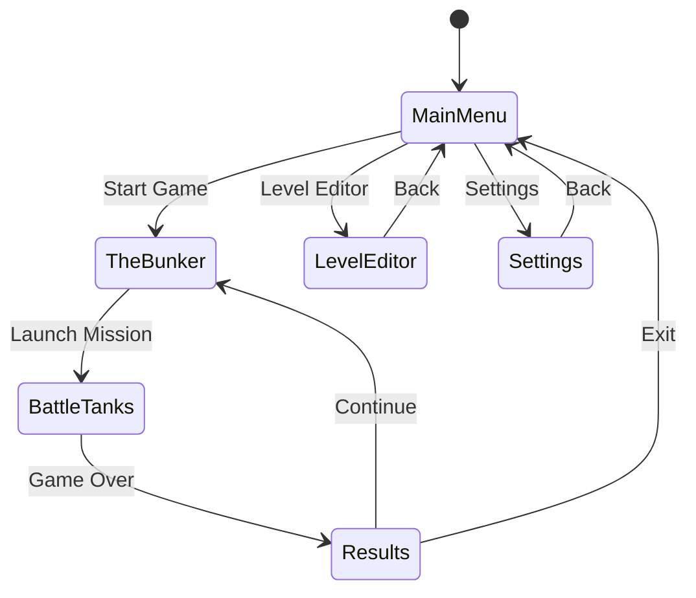

# REACT-TANKS

A TRON-inspired tank combat game built with React Three Fiber featuring wireframe aesthetics, strategic grid-based gameplay, and community-driven level editing.

## Description

REACT-TANKS is a browser-based 3D tank combat game that captures the iconic visual style of TRON (1982). Players navigate geometric arenas in wireframe tanks, engaging in strategic battles using energy projectiles and environmental cover. The game features a complete progression loop with customizable loadouts, a powerful level editor, and support for community-created content.

The visual aesthetic is pure wireframe geometry with neon-lit edges—no PNG textures are used. All rendering follows an SVGA shader style with vibrant cyan, magenta, orange, and white color palettes against dark backgrounds.

## Game Architecture

```
┌─────────────────────────────────────────────────────────────┐
│                        App.tsx                               │
│  (Root component, state management, screen routing)          │
├─────────────────────────────────────────────────────────────┤
│                                                              │
│  ┌──────────────┐  ┌──────────────┐  ┌──────────────┐       │
│  │  MainMenu    │  │  TheBunker   │  │ BattleTanks  │       │
│  │  Screen.tsx  │  │  Screen.tsx  │  │ Screen.tsx   │       │
│  └──────────────┘  └──────────────┘  └──────────────┘       │
│                                                              │
│  ┌──────────────┐  ┌──────────────┐  ┌──────────────┐       │
│  │   Results    │  │ LevelEditor  │  │  Settings    │       │
│  │  Screen.tsx  │  │  Screen.tsx  │  │  Screen.tsx  │       │
│  └──────────────┘  └──────────────┘  └──────────────┘       │
│                                                              │
├─────────────────────────────────────────────────────────────┤
│                    Shared Components                         │
│  ┌────────────┐ ┌────────────┐ ┌────────────┐               │
│  │ 3D/        │ │ UI/        │ │ Game/      │               │
│  │ Tank.tsx   │ │ HUD.tsx    │ │ GameState  │               │
│  │ Arena.tsx  │ │ Button.tsx │ │ .ts        │               │
│  │ Skybox.tsx │ │ Panel.tsx  │ │ Physics.ts │               │
│  │ Grid.tsx   │ │ Slider.tsx │ │ Input.ts   │               │
│  └────────────┘ └────────────┘ └────────────┘               │
└─────────────────────────────────────────────────────────────┘
```

## Functionality

### Screen Flow



### Screen Specifications

#### 1. Main Menu Screen (`screens/MainMenuScreen.tsx`)

**Visual Layout:**
- Centered vertically and horizontally
- Large "REACT-TANKS" title with glowing cyan wireframe effect
- Four menu buttons stacked vertically with 20px spacing
- Animated wireframe tank rotating slowly in background

**Menu Options:**
| Button | Action |
|--------|--------|
| START GAME | Navigate to TheBunker screen |
| LEVEL EDITOR | Navigate to LevelEditor screen |
| SETTINGS | Navigate to Settings screen |
| EXIT | Close application / show exit confirmation |

**Interactions:**
- Buttons glow brighter on hover (opacity 0.7 → 1.0)
- Click triggers screen transition with fade effect (300ms)
- Keyboard navigation: Arrow keys to select, Enter to confirm

---

#### 2. The Bunker Screen (`screens/TheBunkerScreen.tsx`)

**Purpose:** Pre-game setup, loadout selection, and mission briefing.

**Layout Sections:**

```
┌─────────────────────────────────────────────────────────┐
│  [BACK]                    THE BUNKER                   │
├───────────────────┬─────────────────────────────────────┤
│                   │                                     │
│   TANK PREVIEW    │         LOADOUT PANEL               │
│   (3D rotating    │   ┌─────────────────────────────┐   │
│    tank model)    │   │ Primary: [Dropdown]         │   │
│                   │   │ Secondary: [Dropdown]       │   │
│                   │   │ Ability: [Dropdown]         │   │
│                   │   │ Armor: [Slider]             │   │
│                   │   │ Speed: [Slider]             │   │
│                   │   └─────────────────────────────┘   │
├───────────────────┴─────────────────────────────────────┤
│                    LEVEL SELECT                          │
│   [Level 1] [Level 2] [Level 3] [Custom...] [Random]    │
├─────────────────────────────────────────────────────────┤
│  Mission: Destroy all enemy tanks                       │
│                              [LAUNCH MISSION]           │
└─────────────────────────────────────────────────────────┘
```

**Tank Customization Options:**

```typescript
interface TankLoadout {
  primary: 'standard' | 'rapid' | 'heavy' | 'spread';
  secondary: 'missile' | 'mine' | 'shield' | 'none';
  ability: 'boost' | 'cloak' | 'scan' | 'repair';
  armor: number;    // 1-10, affects damage resistance
  speed: number;    // 1-10, affects movement speed
  color: string;    // Hex color for tank wireframe
}
```

**Level Selection:**
- Grid of level thumbnail previews (wireframe top-down view)
- Built-in levels numbered 1-10
- "Custom" button opens file picker for community levels
- "Random" generates procedural arena

---

#### 3. Battle Tanks Screen (`screens/BattleTanksScreen.tsx`)

**Primary Gameplay Arena**

**Camera System:**
- Third-person chase camera, 15 units behind tank, 8 units above
- Smooth follow with 0.1 lerp factor
- Camera collision avoidance with arena boundaries
- Optional: First-person view toggle (V key)

**HUD Elements (`components/ui/GameHUD.tsx`):**

```
┌─────────────────────────────────────────────────────────┐
│ [HEALTH BAR]████████░░  80%          [MINIMAP]         │
│ [ENERGY BAR]██████████  100%              ·            │
│                                         · × ·          │
│                                           ·            │
│                                                        │
│                     (3D GAME VIEW)                     │
│                                                        │
│                                                        │
│                                                        │
│                                                        │
│ [PRIMARY: Ready]  [SECONDARY: 3/3]  [ABILITY: 85%]    │
│                                      [ESC: Pause]      │
└─────────────────────────────────────────────────────────┘
```

**Player Controls:**

| Input | Action |
|-------|--------|
| W / ↑ | Move forward |
| S / ↓ | Move backward |
| A / ← | Rotate left |
| D / → | Rotate right |
| Mouse Move | Aim turret |
| Left Click | Fire primary weapon |
| Right Click | Fire secondary weapon |
| Space | Activate ability |
| V | Toggle camera view |
| ESC | Pause menu |

**Combat Mechanics:**

```typescript
interface Projectile {
  id: string;
  type: 'energy' | 'missile' | 'mine';
  position: Vector3;
  velocity: Vector3;
  damage: number;
  owner: string;      // Tank ID that fired it
  lifetime: number;   // Seconds until despawn
}

interface DamageEvent {
  target: string;     // Tank ID
  amount: number;
  source: string;     // Projectile or collision
  position: Vector3;
}
```

**Weapon Specifications:**

| Weapon | Damage | Fire Rate | Projectile Speed | Special |
|--------|--------|-----------|------------------|---------|
| Standard | 15 | 2/sec | 50 units/sec | None |
| Rapid | 8 | 5/sec | 60 units/sec | None |
| Heavy | 40 | 0.5/sec | 30 units/sec | Splash damage (5 unit radius) |
| Spread | 10×3 | 1/sec | 45 units/sec | 3 projectiles, 15° spread |
| Missile | 50 | 0.3/sec | 25 units/sec | Homing, limited supply (3) |
| Mine | 80 | 0.2/sec | 0 | Proximity detonation |

**Enemy AI Behaviors:**

```typescript
type AIState = 'patrol' | 'chase' | 'attack' | 'flee' | 'seek_cover';

interface EnemyAI {
  state: AIState;
  detectionRange: number;    // Units to spot player
  attackRange: number;       // Units to start firing
  accuracy: number;          // 0-1, affects aim deviation
  reactionTime: number;      // Seconds before state change
  prefersCover: boolean;     // Seeks barriers when damaged
}
```

**Victory/Defeat Conditions:**
- **Victory:** All enemy tanks destroyed
- **Defeat:** Player tank health reaches 0
- **Time Limit (optional):** Configurable per level, defeat if exceeded

---

#### 4. Results Screen (`screens/ResultsScreen.tsx`)

**Post-Game Statistics Display:**

```
┌─────────────────────────────────────────────────────────┐
│                      MISSION COMPLETE                    │
│                         ★ ★ ★                           │
├─────────────────────────────────────────────────────────┤
│                                                          │
│   Time:           2:34                                   │
│   Enemies Destroyed:  5/5                                │
│   Accuracy:       73%                                    │
│   Damage Taken:   45                                     │
│   Max Combo:      3                                      │
│                                                          │
│   ─────────────────────────────────────                  │
│   SCORE:          12,450                                 │
│   XP EARNED:      +250                                   │
│   NEW RANK:       Corporal ↑                             │
│                                                          │
├─────────────────────────────────────────────────────────┤
│        [CONTINUE]              [MAIN MENU]               │
└─────────────────────────────────────────────────────────┘
```

**Scoring Formula:**

```typescript
function calculateScore(stats: GameStats): number {
  const baseScore = stats.enemiesDestroyed * 1000;
  const timeBonus = Math.max(0, (300 - stats.timeSeconds) * 10);
  const accuracyBonus = Math.floor(stats.accuracy * 2000);
  const damageDeduction = stats.damageTaken * 5;
  const comboBonus = stats.maxCombo * 500;
  
  return baseScore + timeBonus + accuracyBonus - damageDeduction + comboBonus;
}
```

---

#### 5. Level Editor Screen (`screens/LevelEditorScreen.tsx`)

**Full-Featured Arena Builder**

**Layout:**

```
┌─────────────────────────────────────────────────────────┐
│ [FILE ▼] [EDIT ▼] [VIEW ▼]              [TEST] [BACK]  │
├────────────┬────────────────────────────────────────────┤
│            │                                            │
│  TOOLBOX   │           EDITOR VIEWPORT                  │
│            │           (Top-down grid view)             │
│ [Select]   │                                            │
│ [Wall]     │      ┌───┐         ┌─────────┐            │
│ [Barrier]  │      │   │         │         │            │
│ [Spawn]    │      └───┘    P    │         │            │
│ [Enemy]    │               ↓    └─────────┘            │
│ [Pickup]   │         E →                               │
│ [Objective]│                                            │
│            │                                            │
│ ─────────  │────────────────────────────────────────────│
│ PROPERTIES │  Grid: 50×50  |  Objects: 12  |  Valid ✓  │
│ Width: [5] │                                            │
│ Height:[3] │                                            │
│ Rotation:  │                                            │
│   [0°]     │                                            │
└────────────┴────────────────────────────────────────────┘
```

**Editor Tools:**

| Tool | Icon | Function |
|------|------|----------|
| Select | ⬚ | Click to select objects, drag to move |
| Wall | ▬ | Place solid barriers (blocks movement & projectiles) |
| Barrier | ▤ | Place cover (blocks projectiles, not movement) |
| Spawn | P | Set player spawn point (exactly 1 required) |
| Enemy | E | Place enemy tank spawn |
| Pickup | ◈ | Place health/ammo pickups |
| Objective | ⬡ | Place mission objectives |

**Level Data Structure:**

```typescript
interface LevelData {
  meta: {
    name: string;
    author: string;
    version: string;
    gridSize: { width: number; height: number };
    difficulty: 'easy' | 'medium' | 'hard';
    timeLimit?: number;
  };
  terrain: TerrainObject[];
  spawns: {
    player: Vector2;
    enemies: EnemySpawn[];
  };
  pickups: Pickup[];
  objectives: Objective[];
}

interface TerrainObject {
  id: string;
  type: 'wall' | 'barrier';
  position: Vector2;
  size: { width: number; height: number };
  rotation: number;
}

interface EnemySpawn {
  position: Vector2;
  aiType: 'patrol' | 'guard' | 'aggressive';
  delay: number;      // Seconds after level start
}

interface Pickup {
  id: string;
  type: 'health' | 'ammo' | 'energy' | 'shield';
  position: Vector2;
  respawnTime?: number;
}

interface Objective {
  id: string;
  type: 'destroy' | 'capture' | 'survive' | 'reach';
  position?: Vector2;
  target?: string;
  duration?: number;
}
```

**File Operations:**
- **New:** Clear editor, prompt for grid size
- **Save:** Export to JSON with `.rtlevel` extension
- **Load:** Import `.rtlevel` files
- **Test:** Launch BattleTanks with current level

**Validation Rules:**
- Exactly 1 player spawn required
- At least 1 enemy spawn required
- No overlapping solid objects
- Spawns not inside walls
- Grid bounds respected (max 100×100)

---

#### 6. Settings Screen (`screens/SettingsScreen.tsx`)

**Tabbed Settings Interface:**

```
┌─────────────────────────────────────────────────────────┐
│                       SETTINGS                           │
│  [GRAPHICS] [AUDIO] [CONTROLS] [GAMEPLAY]               │
├─────────────────────────────────────────────────────────┤
│                                                          │
│   Quality Preset:    [Low] [Medium] [●High] [Ultra]     │
│                                                          │
│   Wireframe Glow:    ████████░░  80%                    │
│   Bloom Intensity:   ██████░░░░  60%                    │
│   Grid Lines:        [✓] Enabled                        │
│   Particle Effects:  [✓] Enabled                        │
│                                                          │
│   Skybox Style:      [▼ Sunset Grid        ]            │
│                                                          │
│   Resolution:        [▼ 1920×1080          ]            │
│   Fullscreen:        [✓] Enabled                        │
│                                                          │
├─────────────────────────────────────────────────────────┤
│              [RESET DEFAULTS]        [APPLY]             │
└─────────────────────────────────────────────────────────┘
```

**Settings Categories:**

**Graphics:**
```typescript
interface GraphicsSettings {
  qualityPreset: 'low' | 'medium' | 'high' | 'ultra';
  wireframeGlow: number;      // 0-100
  bloomIntensity: number;     // 0-100
  gridLinesEnabled: boolean;
  particleEffects: boolean;
  skyboxStyle: 'sunset' | 'night' | 'dawn' | 'storm' | 'void';
  resolution: string;
  fullscreen: boolean;
}
```

**Audio:**
```typescript
interface AudioSettings {
  masterVolume: number;       // 0-100
  musicVolume: number;        // 0-100
  sfxVolume: number;          // 0-100
  uiSounds: boolean;
}
```

**Controls:**
```typescript
interface ControlSettings {
  mouseSensitivity: number;   // 0.1-3.0
  invertY: boolean;
  keyBindings: Record<Action, string>;  // Rebindable keys
}
```

**Gameplay:**
```typescript
interface GameplaySettings {
  difficulty: 'easy' | 'normal' | 'hard' | 'brutal';
  autoAim: boolean;           // Easy mode only
  showDamageNumbers: boolean;
  cameraShake: boolean;
  tutorialHints: boolean;
}
```

---

## Technical Implementation

### File Structure

```
src/
├── App.tsx                      # Root component, global state
├── main.tsx                     # Entry point
├── index.css                    # Global styles, CSS variables
│
├── screens/
│   ├── MainMenuScreen.tsx       # Main menu
│   ├── TheBunkerScreen.tsx      # Loadout/setup
│   ├── BattleTanksScreen.tsx    # Main gameplay
│   ├── ResultsScreen.tsx        # Post-game stats
│   ├── LevelEditorScreen.tsx    # Level editor
│   └── SettingsScreen.tsx       # Settings
│
├── components/
│   ├── three/                   # 3D components (R3F)
│   │   ├── Tank.tsx             # Tank model & animation
│   │   ├── EnemyTank.tsx        # Enemy with AI
│   │   ├── Projectile.tsx       # Bullets, missiles
│   │   ├── Arena.tsx            # Level geometry
│   │   ├── Grid.tsx             # Ground grid
│   │   ├── Skybox.tsx           # Procedural sky
│   │   ├── Barrier.tsx          # Cover objects
│   │   ├── Pickup.tsx           # Collectibles
│   │   └── Effects.tsx          # Explosions, trails
│   │
│   ├── ui/                      # 2D UI components
│   │   ├── Button.tsx           # Styled button
│   │   ├── Panel.tsx            # Container panel
│   │   ├── Slider.tsx           # Range input
│   │   ├── Dropdown.tsx         # Select input
│   │   ├── GameHUD.tsx          # In-game overlay
│   │   ├── PauseMenu.tsx        # Pause overlay
│   │   ├── Minimap.tsx          # Radar display
│   │   └── HealthBar.tsx        # Health/energy bars
│   │
│   └── editor/                  # Level editor components
│       ├── EditorViewport.tsx   # 2D editor canvas
│       ├── Toolbox.tsx          # Tool selection
│       ├── PropertiesPanel.tsx  # Object properties
│       └── EditorMenuBar.tsx    # File/Edit menus
│
├── hooks/
│   ├── useGameState.ts          # Game state management
│   ├── useInput.ts              # Keyboard/mouse input
│   ├── useAudio.ts              # Sound management
│   ├── useSettings.ts           # Persist settings
│   └── useLevel.ts              # Level loading
│
├── systems/
│   ├── physics.ts               # Collision detection
│   ├── ai.ts                    # Enemy AI logic
│   ├── combat.ts                # Damage calculation
│   ├── scoring.ts               # Score/XP system
│   └── progression.ts           # Unlocks, ranks
│
├── types/
│   ├── game.ts                  # Game interfaces
│   ├── level.ts                 # Level data types
│   └── settings.ts              # Settings types
│
├── data/
│   ├── levels/                  # Built-in level JSONs
│   │   ├── level01.json
│   │   ├── level02.json
│   │   └── ...
│   └── defaults.ts              # Default settings/loadouts
│
└── utils/
    ├── math.ts                  # Vector math helpers
    ├── colors.ts                # TRON color palette
    └── storage.ts               # LocalStorage wrapper
```

### Core Types (`types/game.ts`)

```typescript
import { Vector3, Vector2 } from 'three';

// ============ GAME STATE ============

export type GameScreen = 
  | 'mainMenu' 
  | 'bunker' 
  | 'battle' 
  | 'results' 
  | 'editor' 
  | 'settings';

export interface GameState {
  currentScreen: GameScreen;
  isPaused: boolean;
  player: PlayerState;
  enemies: EnemyState[];
  projectiles: Projectile[];
  pickups: PickupState[];
  level: LevelData | null;
  stats: GameStats;
  time: number;
}

// ============ PLAYER ============

export interface PlayerState {
  id: string;
  position: Vector3;
  rotation: number;           // Y-axis rotation (radians)
  turretRotation: number;     // Turret Y-axis rotation
  health: number;
  maxHealth: number;
  energy: number;
  maxEnergy: number;
  loadout: TankLoadout;
  velocity: Vector3;
  isAlive: boolean;
}

export interface TankLoadout {
  primary: WeaponType;
  secondary: SecondaryType;
  ability: AbilityType;
  armor: number;              // 1-10
  speed: number;              // 1-10
  color: string;              // Hex color
}

export type WeaponType = 'standard' | 'rapid' | 'heavy' | 'spread';
export type SecondaryType = 'missile' | 'mine' | 'shield' | 'none';
export type AbilityType = 'boost' | 'cloak' | 'scan' | 'repair';

// ============ ENEMIES ============

export interface EnemyState {
  id: string;
  position: Vector3;
  rotation: number;
  turretRotation: number;
  health: number;
  maxHealth: number;
  ai: AIBehavior;
  isAlive: boolean;
  weaponCooldown: number;
}

export interface AIBehavior {
  state: AIState;
  targetPosition: Vector3 | null;
  lastKnownPlayerPos: Vector3 | null;
  stateTimer: number;
  detectionRange: number;
  attackRange: number;
  accuracy: number;
}

export type AIState = 'idle' | 'patrol' | 'chase' | 'attack' | 'flee' | 'seek_cover';

// ============ COMBAT ============

export interface Projectile {
  id: string;
  type: ProjectileType;
  position: Vector3;
  velocity: Vector3;
  rotation: number;
  damage: number;
  owner: string;
  lifetime: number;
  maxLifetime: number;
}

export type ProjectileType = 'energy' | 'heavy' | 'rapid' | 'spread' | 'missile' | 'mine';

export interface Explosion {
  id: string;
  position: Vector3;
  radius: number;
  duration: number;
  elapsed: number;
}

// ============ PICKUPS ============

export interface PickupState {
  id: string;
  type: PickupType;
  position: Vector3;
  isActive: boolean;
  respawnTimer: number;
}

export type PickupType = 'health' | 'energy' | 'ammo' | 'shield';

// ============ STATISTICS ============

export interface GameStats {
  enemiesDestroyed: number;
  totalEnemies: number;
  shotsFired: number;
  shotsHit: number;
  damageTaken: number;
  damageDealt: number;
  maxCombo: number;
  currentCombo: number;
  comboTimer: number;
  timeSeconds: number;
}

// ============ PROGRESSION ============

export interface PlayerProgression {
  xp: number;
  rank: number;
  rankName: string;
  unlockedWeapons: WeaponType[];
  unlockedAbilities: AbilityType[];
  completedLevels: string[];
  highScores: Record<string, number>;
}
```

### Level Types (`types/level.ts`)

```typescript
import { Vector2 } from 'three';

export interface LevelData {
  meta: LevelMeta;
  terrain: TerrainObject[];
  spawns: SpawnData;
  pickups: LevelPickup[];
  objectives: LevelObjective[];
}

export interface LevelMeta {
  id: string;
  name: string;
  author: string;
  version: string;
  gridSize: GridSize;
  difficulty: Difficulty;
  timeLimit?: number;
  description?: string;
}

export interface GridSize {
  width: number;
  height: number;
}

export type Difficulty = 'easy' | 'medium' | 'hard' | 'brutal';

export interface TerrainObject {
  id: string;
  type: TerrainType;
  position: Vector2;
  size: { width: number; height: number };
  rotation: number;
}

export type TerrainType = 'wall' | 'barrier' | 'ramp' | 'pit';

export interface SpawnData {
  player: Vector2;
  enemies: EnemySpawn[];
}

export interface EnemySpawn {
  id: string;
  position: Vector2;
  aiType: AIPreset;
  delay: number;
  weaponType?: WeaponType;
}

export type AIPreset = 'patrol' | 'guard' | 'aggressive' | 'sniper';

export interface LevelPickup {
  id: string;
  type: PickupType;
  position: Vector2;
  respawnTime?: number;
}

export interface LevelObjective {
  id: string;
  type: ObjectiveType;
  position?: Vector2;
  target?: string;
  count?: number;
  duration?: number;
  description: string;
}

export type ObjectiveType = 'destroy_all' | 'destroy_target' | 'survive' | 'capture' | 'reach';
```

### Physics System (`systems/physics.ts`)

```typescript
import { Vector3, Box3 } from 'three';
import { TerrainObject, PlayerState, EnemyState, Projectile } from '../types/game';

// Grid-based collision using AABB
export interface Collider {
  id: string;
  bounds: Box3;
  type: 'tank' | 'wall' | 'barrier' | 'projectile' | 'pickup';
  solid: boolean;        // Blocks movement
  blocksProjectiles: boolean;
}

export function createCollider(
  id: string,
  position: Vector3,
  size: Vector3,
  type: Collider['type']
): Collider {
  const halfSize = size.clone().multiplyScalar(0.5);
  return {
    id,
    bounds: new Box3(
      position.clone().sub(halfSize),
      position.clone().add(halfSize)
    ),
    type,
    solid: type === 'wall' || type === 'tank',
    blocksProjectiles: type === 'wall' || type === 'barrier',
  };
}

export function checkCollision(a: Collider, b: Collider): boolean {
  return a.bounds.intersectsBox(b.bounds);
}

export function resolveCollision(
  mover: { position: Vector3; velocity: Vector3 },
  collider: Collider
): void {
  // Push mover out of collision
  const center = new Vector3();
  collider.bounds.getCenter(center);
  
  const direction = mover.position.clone().sub(center).normalize();
  const penetration = getPenetrationDepth(mover.position, collider.bounds);
  
  mover.position.add(direction.multiplyScalar(penetration + 0.1));
  
  // Zero velocity in collision direction
  if (Math.abs(direction.x) > Math.abs(direction.z)) {
    mover.velocity.x = 0;
  } else {
    mover.velocity.z = 0;
  }
}

export function getPenetrationDepth(point: Vector3, box: Box3): number {
  const clamped = point.clone().clamp(box.min, box.max);
  return point.distanceTo(clamped);
}

// Raycast for projectile collision
export function raycast(
  origin: Vector3,
  direction: Vector3,
  maxDistance: number,
  colliders: Collider[]
): { hit: boolean; collider?: Collider; point?: Vector3; distance?: number } {
  let closestHit: ReturnType<typeof raycast> = { hit: false };
  let closestDistance = maxDistance;

  for (const collider of colliders) {
    if (!collider.blocksProjectiles) continue;
    
    const result = rayBoxIntersection(origin, direction, collider.bounds);
    if (result.hit && result.distance! < closestDistance) {
      closestDistance = result.distance!;
      closestHit = {
        hit: true,
        collider,
        point: origin.clone().add(direction.clone().multiplyScalar(result.distance!)),
        distance: result.distance,
      };
    }
  }

  return closestHit;
}

function rayBoxIntersection(
  origin: Vector3,
  direction: Vector3,
  box: Box3
): { hit: boolean; distance?: number } {
  const invDir = new Vector3(1/direction.x, 1/direction.y, 1/direction.z);
  
  const t1 = (box.min.x - origin.x) * invDir.x;
  const t2 = (box.max.x - origin.x) * invDir.x;
  const t3 = (box.min.y - origin.y) * invDir.y;
  const t4 = (box.max.y - origin.y) * invDir.y;
  const t5 = (box.min.z - origin.z) * invDir.z;
  const t6 = (box.max.z - origin.z) * invDir.z;

  const tmin = Math.max(Math.min(t1, t2), Math.min(t3, t4), Math.min(t5, t6));
  const tmax = Math.min(Math.max(t1, t2), Math.max(t3, t4), Math.max(t5, t6));

  if (tmax < 0 || tmin > tmax) {
    return { hit: false };
  }

  return { hit: true, distance: tmin > 0 ? tmin : tmax };
}
```

### AI System (`systems/ai.ts`)

```typescript
import { Vector3 } from 'three';
import { EnemyState, AIState, PlayerState, TerrainObject } from '../types/game';
import { Collider, raycast } from './physics';

const AI_CONFIG = {
  patrol: {
    detectionRange: 30,
    attackRange: 25,
    accuracy: 0.6,
    reactionTime: 0.8,
    prefersCover: false,
    aggression: 0.3,
  },
  guard: {
    detectionRange: 25,
    attackRange: 20,
    accuracy: 0.7,
    reactionTime: 0.5,
    prefersCover: true,
    aggression: 0.5,
  },
  aggressive: {
    detectionRange: 40,
    attackRange: 30,
    accuracy: 0.8,
    reactionTime: 0.3,
    prefersCover: false,
    aggression: 0.9,
  },
  sniper: {
    detectionRange: 50,
    attackRange: 45,
    accuracy: 0.95,
    reactionTime: 1.0,
    prefersCover: true,
    aggression: 0.2,
  },
};

export function updateAI(
  enemy: EnemyState,
  player: PlayerState,
  colliders: Collider[],
  deltaTime: number
): Partial<EnemyState> {
  const distanceToPlayer = enemy.position.distanceTo(player.position);
  const canSeePlayer = checkLineOfSight(enemy.position, player.position, colliders);
  
  // Update state timer
  enemy.ai.stateTimer -= deltaTime;
  
  // State machine transitions
  let newState = enemy.ai.state;
  
  if (canSeePlayer) {
    enemy.ai.lastKnownPlayerPos = player.position.clone();
    
    if (distanceToPlayer <= enemy.ai.attackRange) {
      newState = 'attack';
    } else if (distanceToPlayer <= enemy.ai.detectionRange) {
      newState = 'chase';
    }
    
    // Check if should flee (low health)
    if (enemy.health < enemy.maxHealth * 0.25) {
      newState = 'flee';
    }
  } else if (enemy.ai.lastKnownPlayerPos) {
    newState = 'chase';
  } else {
    newState = 'patrol';
  }
  
  // Execute current state behavior
  const updates: Partial<EnemyState> = {};
  
  switch (newState) {
    case 'idle':
      // Do nothing, wait for detection
      break;
      
    case 'patrol':
      updates.position = executePatrol(enemy, colliders, deltaTime);
      break;
      
    case 'chase':
      updates.position = executeChase(enemy, player.position, colliders, deltaTime);
      break;
      
    case 'attack':
      updates.turretRotation = aimAtTarget(enemy.position, player.position, enemy.ai.accuracy);
      // Fire logic handled separately
      break;
      
    case 'flee':
      updates.position = executeFlee(enemy, player.position, colliders, deltaTime);
      break;
      
    case 'seek_cover':
      updates.position = seekCover(enemy, player.position, colliders, deltaTime);
      break;
  }
  
  if (newState !== enemy.ai.state) {
    updates.ai = { ...enemy.ai, state: newState, stateTimer: 2.0 };
  }
  
  return updates;
}

function checkLineOfSight(from: Vector3, to: Vector3, colliders: Collider[]): boolean {
  const direction = to.clone().sub(from).normalize();
  const distance = from.distanceTo(to);
  const result = raycast(from, direction, distance, colliders.filter(c => c.blocksProjectiles));
  return !result.hit;
}

function executePatrol(enemy: EnemyState, colliders: Collider[], dt: number): Vector3 {
  // Simple waypoint patrol
  if (!enemy.ai.targetPosition || enemy.position.distanceTo(enemy.ai.targetPosition) < 1) {
    // Pick new random patrol point
    enemy.ai.targetPosition = new Vector3(
      enemy.position.x + (Math.random() - 0.5) * 20,
      0,
      enemy.position.z + (Math.random() - 0.5) * 20
    );
  }
  
  return moveToward(enemy.position, enemy.ai.targetPosition, 3 * dt);
}

function executeChase(
  enemy: EnemyState, 
  playerPos: Vector3, 
  colliders: Collider[], 
  dt: number
): Vector3 {
  const target = enemy.ai.lastKnownPlayerPos || playerPos;
  return moveToward(enemy.position, target, 5 * dt);
}

function executeFlee(
  enemy: EnemyState, 
  playerPos: Vector3, 
  colliders: Collider[], 
  dt: number
): Vector3 {
  const awayDirection = enemy.position.clone().sub(playerPos).normalize();
  const fleeTarget = enemy.position.clone().add(awayDirection.multiplyScalar(20));
  return moveToward(enemy.position, fleeTarget, 6 * dt);
}

function seekCover(
  enemy: EnemyState,
  playerPos: Vector3,
  colliders: Collider[],
  dt: number
): Vector3 {
  // Find nearest barrier that blocks LOS to player
  const barriers = colliders.filter(c => c.type === 'barrier' || c.type === 'wall');
  let bestCover: Vector3 | null = null;
  let bestScore = Infinity;
  
  for (const barrier of barriers) {
    const center = new Vector3();
    barrier.bounds.getCenter(center);
    
    // Position behind barrier relative to player
    const toBarrier = center.clone().sub(playerPos).normalize();
    const coverPos = center.clone().add(toBarrier.multiplyScalar(3));
    
    const distance = enemy.position.distanceTo(coverPos);
    if (distance < bestScore && !checkLineOfSight(coverPos, playerPos, colliders)) {
      bestScore = distance;
      bestCover = coverPos;
    }
  }
  
  if (bestCover) {
    return moveToward(enemy.position, bestCover, 5 * dt);
  }
  
  return executeFlee(enemy, playerPos, colliders, dt);
}

function moveToward(current: Vector3, target: Vector3, maxDelta: number): Vector3 {
  const direction = target.clone().sub(current).normalize();
  const distance = current.distanceTo(target);
  const moveDistance = Math.min(distance, maxDelta);
  return current.clone().add(direction.multiplyScalar(moveDistance));
}

function aimAtTarget(from: Vector3, to: Vector3, accuracy: number): number {
  const direction = to.clone().sub(from);
  let angle = Math.atan2(direction.x, direction.z);
  
  // Add inaccuracy
  const deviation = (1 - accuracy) * 0.3;
  angle += (Math.random() - 0.5) * deviation;
  
  return angle;
}

export function shouldFire(enemy: EnemyState, player: PlayerState, colliders: Collider[]): boolean {
  if (enemy.ai.state !== 'attack') return false;
  if (enemy.weaponCooldown > 0) return false;
  
  const canSee = checkLineOfSight(enemy.position, player.position, colliders);
  return canSee;
}
```

### Input System (`hooks/useInput.ts`)

```typescript
import { useEffect, useRef, useCallback } from 'react';

export interface InputState {
  // Movement
  forward: boolean;
  backward: boolean;
  left: boolean;
  right: boolean;
  
  // Combat
  firePrimary: boolean;
  fireSecondary: boolean;
  useAbility: boolean;
  
  // Camera
  mouseX: number;
  mouseY: number;
  mouseDelta: { x: number; y: number };
  
  // UI
  pause: boolean;
  toggleView: boolean;
}

export function useInput(enabled: boolean = true): InputState {
  const state = useRef<InputState>({
    forward: false,
    backward: false,
    left: false,
    right: false,
    firePrimary: false,
    fireSecondary: false,
    useAbility: false,
    mouseX: 0,
    mouseY: 0,
    mouseDelta: { x: 0, y: 0 },
    pause: false,
    toggleView: false,
  });

  const handleKeyDown = useCallback((e: KeyboardEvent) => {
    if (!enabled) return;
    
    switch (e.code) {
      case 'KeyW':
      case 'ArrowUp':
        state.current.forward = true;
        break;
      case 'KeyS':
      case 'ArrowDown':
        state.current.backward = true;
        break;
      case 'KeyA':
      case 'ArrowLeft':
        state.current.left = true;
        break;
      case 'KeyD':
      case 'ArrowRight':
        state.current.right = true;
        break;
      case 'Space':
        state.current.useAbility = true;
        break;
      case 'Escape':
        state.current.pause = true;
        break;
      case 'KeyV':
        state.current.toggleView = true;
        break;
    }
  }, [enabled]);

  const handleKeyUp = useCallback((e: KeyboardEvent) => {
    switch (e.code) {
      case 'KeyW':
      case 'ArrowUp':
        state.current.forward = false;
        break;
      case 'KeyS':
      case 'ArrowDown':
        state.current.backward = false;
        break;
      case 'KeyA':
      case 'ArrowLeft':
        state.current.left = false;
        break;
      case 'KeyD':
      case 'ArrowRight':
        state.current.right = false;
        break;
      case 'Space':
        state.current.useAbility = false;
        break;
      case 'Escape':
        state.current.pause = false;
        break;
      case 'KeyV':
        state.current.toggleView = false;
        break;
    }
  }, []);

  const handleMouseMove = useCallback((e: MouseEvent) => {
    if (!enabled) return;
    
    state.current.mouseDelta = {
      x: e.movementX,
      y: e.movementY,
    };
    state.current.mouseX = e.clientX;
    state.current.mouseY = e.clientY;
  }, [enabled]);

  const handleMouseDown = useCallback((e: MouseEvent) => {
    if (!enabled) return;
    
    if (e.button === 0) state.current.firePrimary = true;
    if (e.button === 2) state.current.fireSecondary = true;
  }, [enabled]);

  const handleMouseUp = useCallback((e: MouseEvent) => {
    if (e.button === 0) state.current.firePrimary = false;
    if (e.button === 2) state.current.fireSecondary = false;
  }, []);

  useEffect(() => {
    window.addEventListener('keydown', handleKeyDown);
    window.addEventListener('keyup', handleKeyUp);
    window.addEventListener('mousemove', handleMouseMove);
    window.addEventListener('mousedown', handleMouseDown);
    window.addEventListener('mouseup', handleMouseUp);
    
    // Prevent context menu on right-click
    const preventContext = (e: Event) => e.preventDefault();
    window.addEventListener('contextmenu', preventContext);

    return () => {
      window.removeEventListener('keydown', handleKeyDown);
      window.removeEventListener('keyup', handleKeyUp);
      window.removeEventListener('mousemove', handleMouseMove);
      window.removeEventListener('mousedown', handleMouseDown);
      window.removeEventListener('mouseup', handleMouseUp);
      window.removeEventListener('contextmenu', preventContext);
    };
  }, [handleKeyDown, handleKeyUp, handleMouseMove, handleMouseDown, handleMouseUp]);

  return state.current;
}

// Reset single-frame inputs (pause, toggleView) after reading
export function consumeInput(input: InputState): void {
  input.pause = false;
  input.toggleView = false;
  input.mouseDelta = { x: 0, y: 0 };
}
```

### Color Palette (`utils/colors.ts`)

```typescript
// TRON-inspired color palette
export const TRON_COLORS = {
  // Primary colors
  cyan: '#00FFFF',
  cyanDark: '#00AAAA',
  cyanGlow: '#00FFFF88',
  
  // Enemy colors
  orange: '#FF6600',
  orangeDark: '#AA4400',
  orangeGlow: '#FF660088',
  
  // Accent colors
  magenta: '#FF00FF',
  magentaDark: '#AA00AA',
  
  white: '#FFFFFF',
  whiteDim: '#AAAAAA',
  
  // Background
  black: '#000000',
  darkBlue: '#000022',
  gridBlue: '#001144',
  
  // UI
  panelBg: '#00111188',
  panelBorder: '#00FFFF44',
  
  // Effects
  explosion: '#FFAA00',
  shield: '#00FF00',
  health: '#00FF00',
  energy: '#00AAFF',
  damage: '#FF0000',
} as const;

export type TronColor = keyof typeof TRON_COLORS;

// Get color with custom opacity
export function withOpacity(color: string, opacity: number): string {
  const hex = color.replace('#', '');
  const r = parseInt(hex.substring(0, 2), 16);
  const g = parseInt(hex.substring(2, 4), 16);
  const b = parseInt(hex.substring(4, 6), 16);
  return `rgba(${r}, ${g}, ${b}, ${opacity})`;
}

// Lerp between colors
export function lerpColor(a: string, b: string, t: number): string {
  const hexA = a.replace('#', '');
  const hexB = b.replace('#', '');
  
  const rA = parseInt(hexA.substring(0, 2), 16);
  const gA = parseInt(hexA.substring(2, 4), 16);
  const bA = parseInt(hexA.substring(4, 6), 16);
  
  const rB = parseInt(hexB.substring(0, 2), 16);
  const gB = parseInt(hexB.substring(2, 4), 16);
  const bB = parseInt(hexB.substring(4, 6), 16);
  
  const r = Math.round(rA + (rB - rA) * t);
  const g = Math.round(gA + (gB - gA) * t);
  const b = Math.round(bA + (bB - bA) * t);
  
  return `#${r.toString(16).padStart(2, '0')}${g.toString(16).padStart(2, '0')}${b.toString(16).padStart(2, '0')}`;
}
```

---

## Component Specifications

### Tank Component (`components/three/Tank.tsx`)

```typescript
// Wireframe tank with animated turret
// Props: position, rotation, turretRotation, color, health

interface TankProps {
  position: [number, number, number];
  rotation: number;
  turretRotation: number;
  color: string;
  health: number;
  maxHealth: number;
  isPlayer?: boolean;
}

/*
 * Visual Structure:
 * - Base: Flattened box (2 x 0.5 x 3 units)
 * - Treads: Two elongated boxes on sides
 * - Turret Base: Cylinder (0.6 radius, 0.3 height)
 * - Cannon: Long thin box extending from turret
 * 
 * All meshes use <meshBasicMaterial wireframe color={color} />
 * 
 * Health indicator: Colored bar floating above tank
 * - Green > 60%, Yellow > 30%, Red <= 30%
 * - Only visible for enemies or damaged player
 */
```

### Arena Component (`components/three/Arena.tsx`)

```typescript
// Renders level geometry from LevelData
// Converts 2D level data to 3D wireframe meshes

interface ArenaProps {
  level: LevelData;
}

/*
 * Terrain Rendering:
 * - Walls: Tall boxes (height: 4 units), solid blue wireframe
 * - Barriers: Medium boxes (height: 2 units), semi-transparent
 * 
 * Ground:
 * - GridHelper with level dimensions
 * - Subtle glow effect at intersections
 * 
 * Boundaries:
 * - Invisible collision walls at grid edges
 * - Visual edge glow effect
 */
```

### Skybox Component (`components/three/Skybox.tsx`)

```typescript
// Procedural SVGA-style skybox
// Follows camera, no actual geometry

interface SkyboxProps {
  style: 'sunset' | 'night' | 'dawn' | 'storm' | 'void';
}

/*
 * Implementation:
 * - Use drei's <Sky> or custom shader
 * - Gradient backgrounds with geometric patterns
 * - Stars as small point lights (night mode)
 * - Grid pattern overlay
 * 
 * Style Variants:
 * - sunset: Orange/purple gradient, horizontal grid lines
 * - night: Dark blue/black, star particles, moon glow
 * - dawn: Pink/cyan gradient, rising sun effect
 * - storm: Dark gray, occasional flash effects
 * - void: Pure black with distant cyan grid
 */
```

### GameHUD Component (`components/ui/GameHUD.tsx`)

```typescript
// 2D overlay during gameplay
// Uses HTML/CSS positioned over Canvas

interface GameHUDProps {
  player: PlayerState;
  stats: GameStats;
  level: LevelData;
  onPause: () => void;
}

/*
 * Layout (fixed positioning):
 * - Top-left: Health bar, Energy bar
 * - Top-right: Minimap (radar style)
 * - Bottom-left: Weapon status, ammo counts
 * - Bottom-right: Current objective, timer
 * - Center (hidden unless damaged): Damage indicator flash
 * 
 * Styling:
 * - Semi-transparent dark panels
 * - Cyan border glow
 * - Monospace font (Orbitron or similar)
 */
```

### Level Editor Viewport (`components/editor/EditorViewport.tsx`)

```typescript
// 2D canvas for level editing
// Orthographic top-down view

interface EditorViewportProps {
  level: LevelData;
  selectedTool: EditorTool;
  onPlaceObject: (obj: TerrainObject | EnemySpawn | LevelPickup) => void;
  onSelectObject: (id: string) => void;
  onMoveObject: (id: string, newPos: Vector2) => void;
  onDeleteObject: (id: string) => void;
}

/*
 * Features:
 * - Grid snapping (1 unit grid)
 * - Zoom with scroll wheel (0.5x - 4x)
 * - Pan with middle mouse drag
 * - Click to place with current tool
 * - Drag to move selected objects
 * - Delete key to remove selected
 * - Multi-select with Shift+Click
 * 
 * Visual Indicators:
 * - Player spawn: Cyan circle with P
 * - Enemy spawn: Orange circle with E
 * - Walls: Solid rectangles
 * - Barriers: Striped rectangles
 * - Pickups: Diamond icons
 * - Selection: Dashed cyan outline
 */
```

---

## Style Guide

### Typography

```css
/* Primary font for UI */
font-family: 'Orbitron', 'Courier New', monospace;

/* Sizes */
--font-title: 48px;
--font-heading: 24px;
--font-body: 16px;
--font-small: 12px;

/* Weights */
--font-normal: 400;
--font-bold: 700;
```

### UI Components

```css
/* Panel styling */
.panel {
  background: rgba(0, 17, 34, 0.85);
  border: 1px solid rgba(0, 255, 255, 0.3);
  box-shadow: 
    0 0 10px rgba(0, 255, 255, 0.2),
    inset 0 0 20px rgba(0, 255, 255, 0.1);
  backdrop-filter: blur(4px);
}

/* Button styling */
.button {
  background: transparent;
  border: 2px solid #00FFFF;
  color: #00FFFF;
  padding: 12px 32px;
  font-family: 'Orbitron', monospace;
  text-transform: uppercase;
  letter-spacing: 2px;
  transition: all 0.2s;
}

.button:hover {
  background: rgba(0, 255, 255, 0.2);
  box-shadow: 0 0 20px rgba(0, 255, 255, 0.4);
}

/* Health bar */
.health-bar {
  height: 20px;
  background: rgba(0, 0, 0, 0.5);
  border: 1px solid #00FFFF;
}

.health-bar-fill {
  height: 100%;
  background: linear-gradient(90deg, #00FF00, #88FF88);
  box-shadow: 0 0 10px #00FF00;
  transition: width 0.3s;
}
```

### 3D Wireframe Materials

```typescript
// Standard wireframe material
const wireframeMaterial = new THREE.MeshBasicMaterial({
  color: TRON_COLORS.cyan,
  wireframe: true,
  transparent: true,
  opacity: 0.9,
});

// Glowing wireframe (for player tank)
const glowMaterial = new THREE.ShaderMaterial({
  uniforms: {
    color: { value: new THREE.Color(TRON_COLORS.cyan) },
    glowIntensity: { value: 1.5 },
  },
  vertexShader: /* glsl */`
    varying vec3 vNormal;
    void main() {
      vNormal = normal;
      gl_Position = projectionMatrix * modelViewMatrix * vec4(position, 1.0);
    }
  `,
  fragmentShader: /* glsl */`
    uniform vec3 color;
    uniform float glowIntensity;
    varying vec3 vNormal;
    void main() {
      float intensity = pow(0.7 - dot(vNormal, vec3(0, 0, 1.0)), 2.0);
      gl_FragColor = vec4(color * glowIntensity, intensity);
    }
  `,
  transparent: true,
  wireframe: true,
});
```

---

## Audio Specifications

### Sound Effects (Placeholder Descriptions)

| Sound | Trigger | Description |
|-------|---------|-------------|
| `fire_standard` | Primary fire | Short electronic "pew" |
| `fire_heavy` | Heavy weapon | Deep bass thump |
| `fire_rapid` | Rapid fire | Quick repeated chirps |
| `explosion` | Tank destroyed | Low rumble + high pitch shatter |
| `hit_tank` | Projectile hits tank | Metallic ping |
| `hit_wall` | Projectile hits wall | Dull thud |
| `pickup` | Collect item | Ascending chime |
| `ability_boost` | Speed boost | Engine rev whoosh |
| `ability_cloak` | Cloak activate | Shimmer fade |
| `ui_hover` | Button hover | Soft click |
| `ui_select` | Button click | Confirmation beep |
| `victory` | Level complete | Triumphant fanfare |
| `defeat` | Player destroyed | Descending tone |

### Music

- **Menu:** Ambient synth, slow tempo, mysterious
- **Gameplay:** Driving electronic, adaptive to combat intensity
- **Editor:** Minimal ambient, non-distracting

---

## Performance Goals

| Metric | Target |
|--------|--------|
| Frame Rate | 60 FPS (minimum 30 on low-end) |
| Load Time | < 3 seconds initial load |
| Memory | < 512MB GPU memory |
| Max Enemies | 20 simultaneous |
| Max Projectiles | 100 simultaneous |
| Level Size | Up to 100×100 grid |

### Optimization Strategies

1. **Object Pooling:** Pre-allocate projectiles and effects
2. **LOD:** Reduce wireframe detail at distance
3. **Frustum Culling:** Built into Three.js
4. **Batch Rendering:** Group static geometry
5. **Throttled Updates:** AI updates at 10Hz, physics at 60Hz

---

## Testing Scenarios

### Gameplay Tests

1. **Movement:** Tank moves smoothly in all directions, collides with walls
2. **Combat:** All weapons fire correctly, damage applies, enemies react
3. **AI:** Enemies patrol, detect player, attack, and flee appropriately
4. **Pickups:** Items collected, effects applied, respawn works
5. **Victory:** Level completes when all enemies destroyed
6. **Defeat:** Game over when player health reaches 0

### Editor Tests

1. **Place Objects:** All tools place correct object types
2. **Move Objects:** Drag and drop works with grid snapping
3. **Delete Objects:** Selection and deletion works
4. **Save/Load:** Level exports to JSON, imports correctly
5. **Validation:** Invalid levels show clear error messages
6. **Test Play:** Launch button starts game with current level

### UI Tests

1. **Navigation:** All screens reachable, back buttons work
2. **Settings:** Changes persist, apply correctly to game
3. **Responsiveness:** UI scales for different screen sizes
4. **Keyboard:** Full keyboard navigation support

---

## Accessibility Requirements

1. **Keyboard-Only Play:** All gameplay possible without mouse (arrow keys + space + enter)
2. **Color Blind Mode:** Alternative color schemes (settings option)
3. **High Contrast:** Ensure wireframes visible against backgrounds
4. **Screen Reader:** Menu items have proper aria labels
5. **Pause Anytime:** ESC always pauses, no timed menus
6. **Adjustable Speed:** Game speed slider in settings

---

## Extended Features (Future)

1. **Multiplayer:** Split-screen or network co-op/versus
2. **Campaign:** Story mode with progression between levels
3. **Achievements:** Track accomplishments and unlock rewards
4. **Leaderboards:** Global high scores per level
5. **Workshop:** Share community levels via cloud
6. **Replay System:** Record and playback matches

---

## Dependencies

```json
{
  "dependencies": {
    "react": "^18.2.0",
    "react-dom": "^18.2.0",
    "@react-three/fiber": "^8.15.0",
    "@react-three/drei": "^9.88.0",
    "three": "^0.158.0",
    "zustand": "^4.4.0",
    "uuid": "^9.0.0"
  },
  "devDependencies": {
    "typescript": "^5.2.0",
    "vite": "^5.0.0",
    "@types/react": "^18.2.0",
    "@types/three": "^0.158.0"
  }
}
```

---

## Implementation Notes

1. **State Management:** Use Zustand for global game state, React state for UI
2. **Frame Loop:** Use `useFrame` from R3F for game loop logic
3. **Separation of Concerns:** Keep 3D rendering separate from game logic
4. **No PNG Textures:** All visuals are procedural or wireframe geometry
5. **Module Boundaries:** Each file should be < 300 lines; split as needed
6. **Type Safety:** Full TypeScript coverage, no `any` types

---

*This TINS README provides complete specifications for generating a functional REACT-TANKS game. All features, data structures, and behaviors are explicitly defined to enable accurate implementation.*
