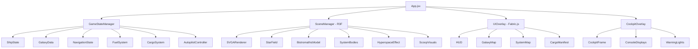

# SPACE TRUCKING

## Description

SPACE TRUCKING is a first-person 3D space hauling simulation inspired by the SVGA-era Elite and Douglas Adams' irreverent take on interstellar commerce. Built with React, React Three Fiber (three.js), drei helpers, and Fabric.js for 2D UI overlays, this implementation recreates the nostalgic visual style of Frontier: Elite II's SVGA graphics—solid color polygons with flat shading and atmospheric depth effects—while focusing on the meditative experience of piloting a massive mining/hauling vessel across procedurally generated trade routes.

The player commands the **Hauler-Class IX "Bistromathic"**, a colossal space freighter the size of a small moon, featuring glacial turn rates, enormous cargo capacity, and the general handling characteristics of a drunk hippopotamus in treacle. The game emphasizes route planning, fuel scooping, and the existential poetry of long-haul space trucking—where the journey matters more than the destination, and the destination is usually just another grey rock with a warehouse attached.

Drawing inspiration from Douglas Adams' "Space Trucking" and the cultural phenomenon of interstellar commerce depicted in The Hitchhiker's Guide to the Galaxy, players navigate trade routes between systems, haul improbable cargo, and contemplate the vast meaninglessness of space while their ship slowly rotates toward the next waypoint.

## Visual Design Philosophy: Fake SVGA Rendering

### SVGA Elite Aesthetic

The visual style directly emulates the SVGA version of Frontier: Elite II (1993), which elevated the original wireframe graphics to solid-color polygon rendering with basic shading effects:

#### Core Visual Characteristics
- **Solid Color Polygons**: All 3D objects rendered with flat-shaded solid colors (no textures)
- **Simple Light Model**: Single directional light source creating distinct lit/shadow faces
- **Depth Fog**: Objects fade to black/dark blue at distance, creating atmospheric depth
- **Limited Color Palette**: Each object class uses a constrained palette (ships: grey/blue/orange, stars: spectral colors, planets: terrain-based)
- **Crisp Polygon Edges**: No anti-aliasing, preserving the chunky retro aesthetic
- **Gouraud-style Shading**: Smooth color interpolation across polygon faces

#### Three.js Shader Implementation

```javascript
// SVGAShader.js - Custom shader for SVGA-style rendering
const SVGAVertexShader = `
  varying vec3 vNormal;
  varying vec3 vPosition;
  varying float vDepth;
  
  void main() {
    vNormal = normalize(normalMatrix * normal);
    vPosition = (modelViewMatrix * vec4(position, 1.0)).xyz;
    vDepth = -vPosition.z;
    gl_Position = projectionMatrix * modelViewMatrix * vec4(position, 1.0);
  }
`;

const SVGAFragmentShader = `
  uniform vec3 baseColor;
  uniform vec3 lightDirection;
  uniform float ambientStrength;
  uniform float fogDensity;
  uniform vec3 fogColor;
  uniform float flatShading; // 1.0 for hard edges, 0.0 for smooth
  
  varying vec3 vNormal;
  varying vec3 vPosition;
  varying float vDepth;
  
  void main() {
    // Simple directional light calculation
    vec3 normal = normalize(vNormal);
    float lightIntensity = max(dot(normal, lightDirection), 0.0);
    
    // Quantize light for retro stepped shading (8 levels)
    float quantizedLight = floor(lightIntensity * 8.0) / 8.0;
    
    // Mix ambient and directional
    float finalLight = ambientStrength + (1.0 - ambientStrength) * quantizedLight;
    
    // Apply to base color
    vec3 litColor = baseColor * finalLight;
    
    // Depth fog (exponential)
    float fogFactor = 1.0 - exp(-fogDensity * vDepth);
    vec3 finalColor = mix(litColor, fogColor, clamp(fogFactor, 0.0, 1.0));
    
    gl_FragColor = vec4(finalColor, 1.0);
  }
`;

// Material factory for SVGA-style objects
function createSVGAMaterial(baseColor, options = {}) {
  return new THREE.ShaderMaterial({
    uniforms: {
      baseColor: { value: new THREE.Color(baseColor) },
      lightDirection: { value: new THREE.Vector3(0.5, 0.8, 0.3).normalize() },
      ambientStrength: { value: options.ambient || 0.3 },
      fogDensity: { value: options.fogDensity || 0.00008 },
      fogColor: { value: new THREE.Color(options.fogColor || '#000011') },
      flatShading: { value: options.flatShading ? 1.0 : 0.0 }
    },
    vertexShader: SVGAVertexShader,
    fragmentShader: SVGAFragmentShader,
    flatShading: true
  });
}
```

#### Color Palette by Object Type

**Stars (Spectral Classes)**:
```javascript
const STAR_COLORS = {
  O: { base: '#6B8BFF', lit: '#9BB8FF', dark: '#3A4D8C' },  // Hot blue
  B: { base: '#8BA8FF', lit: '#AAC4FF', dark: '#4D5F8C' },  // Blue-white
  A: { base: '#CADCFF', lit: '#E8F0FF', dark: '#6B7A99' },  // White
  F: { base: '#F8F4E8', lit: '#FFFBF0', dark: '#8C8A7A' },  // Yellow-white
  G: { base: '#FFE8C4', lit: '#FFF4DC', dark: '#8C7A55' },  // Yellow (Sol-type)
  K: { base: '#FFB870', lit: '#FFD4A0', dark: '#8C5F35' },  // Orange
  M: { base: '#FF7850', lit: '#FFA080', dark: '#8C3C25' },  // Red dwarf
  L: { base: '#8B4040', lit: '#A06060', dark: '#4A2020' },  // Brown dwarf (non-scoopable)
  T: { base: '#604040', lit: '#806060', dark: '#302020' },  // Cool brown dwarf
  Y: { base: '#403030', lit: '#604848', dark: '#201818' }   // Ultra-cool dwarf
};
```

**Player Vessel (Hauler-Class IX)**:
```javascript
const SHIP_COLORS = {
  hull: { base: '#7A8090', lit: '#9AA0B0', dark: '#4A5060' },      // Industrial grey
  engines: { base: '#FF6030', lit: '#FF8050', dark: '#8C3018' },   // Reactor orange
  cargo: { base: '#606878', lit: '#808898', dark: '#303840' },     // Cargo bay grey-blue
  cockpit: { base: '#305080', lit: '#4070A0', dark: '#182840' },   // Cockpit glass blue
  lights: { base: '#FFFF80', lit: '#FFFFB0', dark: '#8C8C40' },    // Running lights
  markings: { base: '#E8E0D0', lit: '#FFF8F0', dark: '#7A7568' }   // Identification stripes
};
```

**Planets**:
```javascript
const PLANET_COLORS = {
  rocky: { base: '#8C7A68', lit: '#A89888', dark: '#4A3D34' },
  gasGiant: { base: '#C0A080', lit: '#E0C8A8', dark: '#6A5844' },
  iceWorld: { base: '#A8C8E0', lit: '#C8E0F0', dark: '#5468 7A' },
  waterWorld: { base: '#4080B0', lit: '#60A0D0', dark: '#204060' },
  volcanic: { base: '#A04020', lit: '#C06040', dark: '#502010' },
  earthlike: { base: '#408050', lit: '#60A070', dark: '#204028' }
};
```

**Stations & Structures**:
```javascript
const STATION_COLORS = {
  coriolis: { base: '#606878', lit: '#808898', dark: '#303840' },
  orbis: { base: '#788090', lit: '#98A0B0', dark: '#3C4048' },
  outpost: { base: '#705840', lit: '#907860', dark: '#382C20' },
  industrial: { base: '#585858', lit: '#787878', dark: '#2C2C2C' }
};
```

### Cockpit Interior Layer

The cockpit is rendered as a detailed 2D/3D hybrid overlay that sits above all gameplay elements, providing the classic "looking through a window" feel of Elite:

#### Cockpit Structure
```javascript
// CockpitOverlay.jsx - Detailed interior frame
const CockpitOverlay = ({ shipState, alerts }) => {
  return (
    <group>
      {/* Main cockpit frame - rendered last (on top) */}
      <mesh renderOrder={1000}>
        <planeGeometry args={[16, 9]} />
        <meshBasicMaterial transparent depthTest={false}>
          {/* Cockpit frame texture with cut-out for viewport */}
        </meshBasicMaterial>
      </mesh>
      
      {/* Left console bank */}
      <CockpitConsole position={[-6, -2, 0]} type="navigation" data={shipState.navigation} />
      
      {/* Right console bank */}
      <CockpitConsole position={[6, -2, 0]} type="engineering" data={shipState.systems} />
      
      {/* Center console (below viewport) */}
      <CockpitConsole position={[0, -4, 0]} type="piloting" data={shipState.flight} />
      
      {/* Overhead panel */}
      <CockpitConsole position={[0, 4, 0]} type="comms" data={shipState.comms} />
      
      {/* Struts and frame elements */}
      <CockpitStruts />
      
      {/* Warning lights */}
      <WarningLightArray alerts={alerts} />
    </group>
  );
};
```

#### Cockpit Visual Elements
```
┌─────────────────────────────────────────────────────────────────────────────┐
│ ▓▓▓▓▓▓▓▓▓▓▓▓▓▓▓▓▓▓▓▓▓▓▓▓▓▓▓▓▓▓▓▓▓▓▓▓▓▓▓▓▓▓▓▓▓▓▓▓▓▓▓▓▓▓▓▓▓▓▓▓▓▓▓▓▓▓▓▓▓▓▓▓▓ │
│ ▓                                                                         ▓ │
│ ▓   [COMMS]                 OVERHEAD PANEL                    [STATUS]    ▓ │
│ ▓                                                                         ▓ │
│ ▓▓▓╔═══════════════════════════════════════════════════════════════════╗▓▓▓ │
│ ▓▓▓║                                                                   ║▓▓▓ │
│ ▓▓▓║                                                                   ║▓▓▓ │
│ ▓▓▓║                       MAIN VIEWPORT                               ║▓▓▓ │
│ ▓▓▓║                    (3D Scene Renders Here)                        ║▓▓▓ │
│ ▓▓▓║                                                                   ║▓▓▓ │
│ ▓▓▓║                                                                   ║▓▓▓ │
│ ▓▓▓╠═════════════════════════╦═══════════════╦═════════════════════════╣▓▓▓ │
│ ▓▓▓║                         ║               ║                         ║▓▓▓ │
│ ▓▓▓║   NAVIGATION CONSOLE    ║  PILOT CTRL   ║   ENGINEERING CONSOLE   ║▓▓▓ │
│ ▓▓▓║   ┌─────────────────┐   ║ ┌───────────┐ ║   ┌─────────────────┐   ║▓▓▓ │
│ ▓▓▓║   │ TARGET: NONE    │   ║ │  HEADING  │ ║   │ FUEL: ████████░ │   ║▓▓▓ │
│ ▓▓▓║   │ DIST: --- LY    │   ║ │   045°    │ ║   │ HEAT: ██░░░░░░░ │   ║▓▓▓ │
│ ▓▓▓║   │ ROUTE: CLEAR    │   ║ │  SPEED    │ ║   │ HULL: 100%      │   ║▓▓▓ │
│ ▓▓▓║   │ WAYPOINT: ---   │   ║ │  30 KM/S  │ ║   │ CARGO: 0/2000T  │   ║▓▓▓ │
│ ▓▓▓║   └─────────────────┘   ║ └───────────┘ ║   └─────────────────┘   ║▓▓▓ │
│ ▓▓▓║                         ║               ║                         ║▓▓▓ │
│ ▓▓▓╚═════════════════════════╩═══════════════╩═════════════════════════╝▓▓▓ │
│ ▓▓▓▓▓▓▓▓▓▓▓▓▓▓▓▓▓▓▓▓▓▓▓▓▓▓▓▓▓▓▓▓▓▓▓▓▓▓▓▓▓▓▓▓▓▓▓▓▓▓▓▓▓▓▓▓▓▓▓▓▓▓▓▓▓▓▓▓▓▓▓▓▓ │
└─────────────────────────────────────────────────────────────────────────────┘
```

The cockpit frame uses a muted industrial palette (#3A3D42 for frame, #2A2D32 for recessed panels, #4A4D52 for raised surfaces) with amber (#FFB040) and cyan (#40D0FF) illuminated displays.

## Core Functionality

### 1. The Player Vessel: Hauler-Class IX "Bistromathic"

#### 1.1 Vessel Specifications

The Bistromathic is not so much a spaceship as it is a mobile warehouse with delusions of grandeur. Named after Douglas Adams' famous Bistromathic Drive (which operates on the principles of restaurant mathematics), this vessel embodies the philosophy that getting there slowly but with a lot of stuff is better than getting there quickly with nothing.

```javascript
const BISTROMATHIC_SPECS = {
  name: "Bistromathic",
  class: "Hauler-Class IX Heavy Freighter",
  manufacturer: "Sirius Cybernetics Cargo Division",
  
  // Physical dimensions (in meters)
  dimensions: {
    length: 892,
    width: 445,
    height: 178
  },
  
  // Mass properties
  mass: {
    hull: 12500,      // Base hull mass in tons
    maxCargo: 2000,   // Cargo capacity in tons
    fuelCapacity: 128, // Fuel capacity in tons
    currentCargo: 0,
    currentFuel: 128
  },
  
  // Performance characteristics (intentionally sluggish)
  performance: {
    maxThrust: 18,           // m/s² (pathetic)
    maxYawRate: 0.8,         // degrees/second (glacial)
    maxPitchRate: 0.6,       // degrees/second
    maxRollRate: 1.2,        // degrees/second
    supercruiseAccel: 0.05,  // c/second (in supercruise)
    supercruiseMax: 800      // times speed of light (slower than combat ships)
  },
  
  // FSD properties (massive but short-range due to mass)
  fsd: {
    class: 7,
    rating: 'B',
    optimalMass: 1800,
    maxRange: 18.5,         // LY when empty
    ladenRange: 12.2,       // LY with full cargo
    chargeTime: 6,          // seconds (slow to spin up)
    cooldown: 15            // seconds between jumps
  },
  
  // Fuel scoop (industrial-grade)
  fuelScoop: {
    class: 6,
    rating: 'A',
    maxRate: 878,           // kg/s
    heatEfficiency: 0.85    // Better heat management than combat scoops
  },
  
  // Hull integrity
  hull: {
    maxIntegrity: 100,
    currentIntegrity: 100,
    armorRating: 3          // Resists minor impacts
  }
};
```

#### 1.2 Handling Characteristics

The Bistromathic handles like what it is: a massive industrial vessel designed for efficiency, not agility.

```javascript
function updateShipMovement(shipState, input, deltaTime) {
  const specs = BISTROMATHIC_SPECS;
  
  // Calculate current total mass
  const totalMass = specs.mass.hull + 
                    shipState.cargo + 
                    shipState.currentFuel;
  
  // Mass affects maneuverability (heavier = slower turns)
  const massRatio = specs.mass.hull / totalMass;
  const agilityFactor = Math.pow(massRatio, 0.7); // Nonlinear reduction
  
  // Apply rotation with significant inertia
  const rotationDamping = 0.95; // High damping for "heavy" feel
  
  // Yaw (left/right)
  const targetYawRate = input.yaw * specs.performance.maxYawRate * agilityFactor;
  shipState.yawRate = lerp(shipState.yawRate, targetYawRate, 0.02 * deltaTime);
  shipState.yawRate *= rotationDamping;
  shipState.rotation.yaw += shipState.yawRate * deltaTime;
  
  // Pitch (up/down) - even slower
  const targetPitchRate = input.pitch * specs.performance.maxPitchRate * agilityFactor;
  shipState.pitchRate = lerp(shipState.pitchRate, targetPitchRate, 0.015 * deltaTime);
  shipState.pitchRate *= rotationDamping;
  shipState.rotation.pitch += shipState.pitchRate * deltaTime;
  
  // Roll
  const targetRollRate = input.roll * specs.performance.maxRollRate * agilityFactor;
  shipState.rollRate = lerp(shipState.rollRate, targetRollRate, 0.025 * deltaTime);
  shipState.rollRate *= rotationDamping;
  shipState.rotation.roll += shipState.rollRate * deltaTime;
  
  // Thrust - very slow acceleration
  const maxAccel = specs.performance.maxThrust / totalMass * 1000; // Scaled to mass
  const targetAccel = input.throttle * maxAccel;
  shipState.acceleration = lerp(shipState.acceleration, targetAccel, 0.01 * deltaTime);
  
  return shipState;
}
```

**Handling Feel Goals**:
- Turning should feel like steering an oil tanker
- Full 180° turn takes approximately 45-60 seconds
- Acceleration is gradual and ponderous
- Momentum carries the ship; can't stop on a dime
- Players learn to plan maneuvers well in advance

#### 1.3 Visual Design

The Bistromathic's SVGA model is a chunky, industrial design emphasizing cargo capacity over aesthetics:

```javascript
// BistromathicModel.jsx - Player ship 3D model
function BistromathicModel({ shipState }) {
  return (
    <group>
      {/* Main cargo hull - massive rectangular section */}
      <mesh position={[0, 0, -20]}>
        <boxGeometry args={[80, 30, 200]} />
        <primitive object={createSVGAMaterial(SHIP_COLORS.cargo.base)} />
      </mesh>
      
      {/* Bridge section - forward dome */}
      <mesh position={[0, 20, 80]}>
        <sphereGeometry args={[25, 12, 8]} />
        <primitive object={createSVGAMaterial(SHIP_COLORS.hull.base)} />
      </mesh>
      
      {/* Engine nacelles - four massive units */}
      {[[-35, -10, -110], [35, -10, -110], [-35, 10, -110], [35, 10, -110]].map((pos, i) => (
        <group key={i} position={pos}>
          <mesh>
            <cylinderGeometry args={[15, 20, 60, 8]} />
            <primitive object={createSVGAMaterial(SHIP_COLORS.engines.base)} />
          </mesh>
          {/* Engine glow */}
          <mesh position={[0, 0, -35]}>
            <circleGeometry args={[12, 8]} />
            <primitive object={createSVGAMaterial('#FF4020', { ambient: 1.0 })} />
          </mesh>
        </group>
      ))}
      
      {/* Cargo bay doors (16 segments) */}
      {Array.from({ length: 16 }).map((_, i) => (
        <mesh key={`door-${i}`} position={[0, -15.5, -100 + i * 12]}>
          <boxGeometry args={[78, 1, 10]} />
          <primitive object={createSVGAMaterial(SHIP_COLORS.markings.base)} />
        </mesh>
      ))}
      
      {/* Communication arrays */}
      <mesh position={[0, 35, 40]}>
        <coneGeometry args={[8, 30, 6]} />
        <primitive object={createSVGAMaterial(SHIP_COLORS.hull.base)} />
      </mesh>
      
      {/* Running lights */}
      <pointLight position={[-45, 0, 80]} color="#FF0000" intensity={0.5} />
      <pointLight position={[45, 0, 80]} color="#00FF00" intensity={0.5} />
      <pointLight position={[0, 0, -140]} color="#FFFFFF" intensity={0.5} />
    </group>
  );
}
```

### 2. Frameshift Drive System

#### 2.1 Supercruise Mode

Supercruise for the Bistromathic is like watching paint dry, but in space. The massive vessel accelerates slowly but steadily, eventually reaching respectable superluminal velocities.

- **Activation**: Press and hold 'J' key for 1.0 seconds to engage supercruise
- **Speed Scaling**: Ship accelerates from 30 km/s up to 800c (times speed of light)
- **Acceleration Curve**: Much slower than combat vessels

```javascript
function calculateSupercruiseSpeed(shipState, massLock, throttle, deltaTime) {
  const baseSpeed = 30000; // 30 km/s minimum
  const maxSpeedMultiplier = 800; // 800c maximum (slower than combat ships)
  const c = 299792458; // Speed of light in m/s
  
  // Throttle affects acceleration - slower response for heavy ship
  const throttleFactor = Math.pow(throttle, 1.5); // Less aggressive curve
  
  // Mass lock reduces max speed
  const massLockPenalty = 1 - massLock;
  
  // Target speed
  const targetSpeed = baseSpeed * maxSpeedMultiplier * c * throttleFactor * massLockPenalty;
  
  // MUCH slower acceleration/deceleration for heavy freighter
  const acceleration = 25000; // m/s² (much lower than combat ships)
  const speedDelta = acceleration * deltaTime;
  
  let newSpeed = shipState.velocity;
  if (targetSpeed > shipState.velocity) {
    newSpeed = Math.min(targetSpeed, shipState.velocity + speedDelta);
  } else {
    // Deceleration is even slower
    newSpeed = Math.max(targetSpeed, shipState.velocity - speedDelta * 0.5);
  }
  
  return newSpeed;
}
```

**Mass Lock Effect**:
- Proximity to massive bodies reduces max speed significantly
- The Bistromathic's own mass makes it more susceptible to gravitational effects
- Stars within 100 Ls cause noticeable speed reduction
- Stations apply full mass lock within 15 km (larger zone than combat ships)

**Visual Feedback**:
- Blue-shifted stars ahead when accelerating
- Red-shifted stars behind
- Speed lines fade in at high velocity
- Console displays "SUPERCRUISE ACTIVE" in cyan text
- Engine glow intensifies with throttle

#### 2.2 Hyperspace Jump Mode

Hyperspace jumps for the Bistromathic are longer, louder, and more dramatic than smaller vessels:

- **Activation**: Select target system in galaxy map, press 'J' to initiate jump
- **Charging**: 6-second charge sequence (longer than combat ships)
- **Visual**: Entire ship shudders during charge, cargo bay lights flicker

```javascript
const HYPERSPACE_SEQUENCE = {
  chargeStart: {
    duration: 0,
    effects: ['enginePowerUp', 'consoleFlicker', 'rumbleStart']
  },
  charging: {
    duration: 6000, // 6 seconds
    effects: ['fsdWhine', 'blueGlow', 'starStretch', 'shipVibration']
  },
  engage: {
    duration: 500,
    effects: ['flashWhite', 'soundBoom', 'cameraShake']
  },
  tunnel: {
    duration: 4000, // 4 seconds in hyperspace
    effects: ['hyperspaceTunnel', 'colorShift', 'ambientDrone']
  },
  emerge: {
    duration: 1500,
    effects: ['flashWhite', 'starAppear', 'shipStabilize']
  }
};
```

**Fuel Consumption** (more fuel-hungry than smaller ships):
```javascript
function calculateFuelConsumption(distance, shipState) {
  const baseFuel = 2.5; // Higher base consumption
  const maxRange = calculateJumpRange(shipState);
  const massPenalty = shipState.totalMass / BISTROMATHIC_SPECS.mass.hull;
  
  return baseFuel * Math.pow(distance / maxRange, 2.5) * massPenalty;
}

function calculateJumpRange(shipState) {
  const fsd = BISTROMATHIC_SPECS.fsd;
  const totalMass = shipState.hull + shipState.cargo + shipState.currentFuel;
  const optimalMass = fsd.optimalMass;
  
  // Heavy ships have severely reduced range
  const massRatio = optimalMass / totalMass;
  const baseRange = fsd.maxRange * Math.pow(massRatio, 0.6);
  
  return Math.max(1.0, baseRange); // Minimum 1 LY range
}
```

#### 2.3 Jump Range Display

The HUD prominently displays range information, critical for a vessel with limited jump capability:

```
┌─────────────────────────────────────┐
│  FRAMESHIFT DRIVE STATUS            │
│  ═══════════════════════════════    │
│  RANGE (CURRENT): 14.2 LY           │
│  RANGE (MAX):     18.5 LY           │
│  FUEL STAR:       ████████░░ 81%    │
│  FSD TEMP:        ██░░░░░░░░ 24%    │
│  STATUS:          READY             │
└─────────────────────────────────────┘
```

### 3. 3D Galaxy Map Interface

#### 3.1 Navigation Controls

The galaxy map is the trucker's best friend—a 3D atlas of potential routes and fuel stops:

- **Activation**: Press 'M' key to open galaxy map
- **Camera Controls**:
  - Mouse drag: Rotate view around current focus point
  - Mouse wheel: Zoom in/out (0.1x to 1000x scale)
  - WASD keys: Pan camera in 3D space
  - Q/E keys: Roll camera view
  - Spacebar: Reset to current ship location
- **System Selection**:
  - Left-click any star: Select and display info panel
  - Double-click: Set as jump target
  - Right-click: Add to route waypoints

#### 3.2 Star System Database

```javascript
const starSystemSchema = {
  id: String,
  name: String,
  position: { x: Number, y: Number, z: Number }, // LY from Sol
  
  // Primary star
  starClass: String, // O, B, A, F, G, K, M, L, T, Y
  scoopable: Boolean, // KGB FOAM only
  
  // System properties
  economy: String, // Agricultural, Industrial, Extraction, High-Tech, Service, Military, Colony, Prison, Terraforming
  population: Number,
  government: String,
  
  // Trade data (for cargo hauling)
  exports: [String], // What this system sells cheap
  imports: [String], // What this system needs
  
  // Facilities
  stations: [{
    name: String,
    type: String,
    hasCargo: Boolean,
    hasFuel: Boolean,
    hasRepair: Boolean
  }],
  
  // Bodies
  bodies: [{
    name: String,
    type: String,
    scoopable: Boolean,
    orbit: Number
  }]
};
```

#### 3.3 Route Plotting (Optimized for Heavy Freighters)

The route planner accounts for the Bistromathic's limited range and high fuel consumption:

```javascript
function plotFreighterRoute(startSystem, targetSystem, galaxyData, shipState) {
  const currentRange = calculateJumpRange(shipState);
  
  // A* with fuel-awareness
  const route = aStarPathfinding(
    startSystem,
    targetSystem,
    galaxyData,
    {
      maxJumpDistance: currentRange,
      prioritizeScoopable: true,  // Always look for fuel
      avoidNonScoopable: shipState.currentFuel < 32, // Desperate for fuel
      economicalMode: true  // Use less than max range per jump
    }
  );
  
  // Annotate route with fuel stops
  const annotatedRoute = route.map((system, index) => {
    const distFromPrev = index > 0 ? 
      calculateDistance(route[index - 1].position, system.position) : 0;
    const fuelRequired = calculateFuelConsumption(distFromPrev, shipState);
    
    return {
      ...system,
      jumpNumber: index + 1,
      distance: distFromPrev,
      fuelRequired,
      canScoop: system.scoopable,
      suggestScoop: system.scoopable && (index % 3 === 0 || shipState.currentFuel < 40)
    };
  });
  
  return annotatedRoute;
}
```

**Route Visualization**:
- Yellow line connecting plotted jumps
- Green stars indicate scoopable systems
- Orange markers for suggested fuel stops
- Red segments where fuel may be insufficient
- Display shows: "23 JUMPS / 312.4 LY / FUEL REQ: 45.2T / SCOOP STOPS: 7"

#### 3.4 SVGA Galaxy Map Rendering

```javascript
// GalaxyMapRenderer.jsx
function GalaxyMapStar({ system, isSelected, isInRoute }) {
  const colorSet = STAR_COLORS[system.starClass] || STAR_COLORS.G;
  
  // Size based on star class (O largest, M smallest)
  const sizeMap = { O: 3.0, B: 2.5, A: 2.0, F: 1.8, G: 1.5, K: 1.3, M: 1.0, L: 0.8, T: 0.6, Y: 0.5 };
  const size = sizeMap[system.starClass] || 1.0;
  
  return (
    <mesh position={[system.position.x, system.position.y, system.position.z]}>
      <icosahedronGeometry args={[size, 1]} />
      <primitive object={createSVGAMaterial(
        isSelected ? '#FFFFFF' : colorSet.base,
        { ambient: system.scoopable ? 0.5 : 0.3 }
      )} />
      
      {/* Scoopable indicator ring */}
      {system.scoopable && (
        <mesh rotation={[Math.PI / 2, 0, 0]}>
          <torusGeometry args={[size * 1.5, 0.1, 6, 16]} />
          <primitive object={createSVGAMaterial('#FFAA00', { ambient: 0.8 })} />
        </mesh>
      )}
      
      {/* Route marker */}
      {isInRoute && (
        <mesh position={[0, size + 0.5, 0]}>
          <octahedronGeometry args={[0.3, 0]} />
          <primitive object={createSVGAMaterial('#FFFF00', { ambient: 1.0 })} />
        </mesh>
      )}
    </mesh>
  );
}
```

### 4. System Map Interface

#### 4.1 Local System View

- **Activation**: Press 'N' key to open system map
- **Display**: 2D top-down orbital diagram with SVGA-style planet rendering

```javascript
// SystemMapBody.jsx
function SystemMapBody({ body, distance }) {
  const planetColors = PLANET_COLORS[body.subType] || PLANET_COLORS.rocky;
  
  // Simple circle with SVGA shading
  return (
    <group position={[body.orbitPosition.x, body.orbitPosition.y, 0]}>
      {/* Planet body */}
      <mesh>
        <circleGeometry args={[body.displayRadius, 16]} />
        <primitive object={createSVGAMaterial(planetColors.base)} />
      </mesh>
      
      {/* Shadow side (simple half-circle overlay) */}
      <mesh position={[0, 0, 0.01]} rotation={[0, 0, Math.PI * 0.75]}>
        <circleGeometry args={[body.displayRadius, 16, 0, Math.PI]} />
        <meshBasicMaterial color={planetColors.dark} transparent opacity={0.6} />
      </mesh>
      
      {/* Name label */}
      <Text
        position={[0, -body.displayRadius - 1, 0]}
        fontSize={0.8}
        color="#FFFFFF"
        anchorX="center"
      >
        {body.name}
      </Text>
    </group>
  );
}
```

### 5. Fuel Scooping Mechanics

#### 5.1 Scoopable Star Classification (KGB FOAM)

Only main-sequence stars can be scooped. The mnemonic "KGB FOAM" helps remember:

| Class | Type | Scoopable | Heat Multiplier | Scoop Efficiency |
|-------|------|-----------|-----------------|------------------|
| K | Orange | ✓ | 0.7 | 95% |
| G | Yellow (Sol-type) | ✓ | 0.8 | 100% |
| B | Blue-white | ✓ | 1.3 | 80% |
| F | White | ✓ | 0.9 | 95% |
| O | Blue | ✓ | 1.5 | 70% |
| A | White | ✓ | 1.0 | 90% |
| M | Red dwarf | ✓ | 0.5 | 85% |
| L, T, Y | Brown dwarfs | ✗ | N/A | 0% |
| White dwarf | Stellar remnant | ✗ | N/A | 0% |
| Neutron | Stellar remnant | ✗ | N/A | 0% |

#### 5.2 Scooping Process

The Bistromathic's industrial-grade fuel scoop is designed for prolonged scooping sessions:

```javascript
function updateScooping(deltaTime, shipState, currentStar) {
  if (!currentStar.scoopable) {
    return { scooping: false, rate: 0, heat: shipState.heat };
  }
  
  const scoopSpec = BISTROMATHIC_SPECS.fuelScoop;
  const scoopZoneRadius = currentStar.radius * 1.5;
  const distance = calculateDistance(shipState.position, currentStar.position);
  
  if (distance > scoopZoneRadius || distance < currentStar.radius * 0.8) {
    // Too far or too close (would burn up)
    return { 
      scooping: false, 
      rate: 0, 
      heat: Math.max(0, shipState.heat - 5 * deltaTime),
      warning: distance < currentStar.radius * 0.8 ? 'TOO CLOSE - PULL UP' : null
    };
  }
  
  // Calculate scoop efficiency
  const optimalDistance = currentStar.radius * 1.1;
  const proximityFactor = 1 - Math.abs(distance - optimalDistance) / (scoopZoneRadius - optimalDistance);
  
  // Star class affects efficiency
  const classEfficiency = getStarClassEfficiency(currentStar.class);
  
  // Industrial scoop has better heat management
  const heatMultiplier = getStarHeatMultiplier(currentStar.class) * scoopSpec.heatEfficiency;
  
  // Calculate actual scoop rate
  const actualScoopRate = scoopSpec.maxRate * proximityFactor * classEfficiency;
  
  // Heat generation (industrial scoop runs cooler)
  const heatGain = (actualScoopRate / 1000) * heatMultiplier * 50;
  const heatDissipation = 8 * (shipState.heat / 100); // Better cooling
  const newHeat = Math.max(0, Math.min(150, shipState.heat + (heatGain - heatDissipation) * deltaTime));
  
  // Fuel gained
  const fuelGained = (actualScoopRate / 1000) * deltaTime;
  const newFuel = Math.min(BISTROMATHIC_SPECS.mass.fuelCapacity, shipState.currentFuel + fuelGained);
  
  return {
    scooping: true,
    rate: actualScoopRate,
    heat: newHeat,
    fuel: newFuel,
    efficiency: (proximityFactor * classEfficiency * 100).toFixed(0) + '%'
  };
}
```

#### 5.3 Scoop Zone Visualization

```javascript
// ScoopZone.jsx - SVGA style scoop indicator
function ScoopZone({ star, scoopState }) {
  if (!star.scoopable) return null;
  
  const innerRadius = star.radius * 0.8;  // Danger zone
  const optimalRadius = star.radius * 1.1; // Best scooping
  const outerRadius = star.radius * 1.5;  // Edge of scoop zone
  
  return (
    <group position={star.position}>
      {/* Danger zone (red) */}
      <mesh rotation={[Math.PI / 2, 0, 0]}>
        <ringGeometry args={[star.radius, innerRadius, 24]} />
        <primitive object={createSVGAMaterial('#FF2020', { ambient: 0.8 })} />
      </mesh>
      
      {/* Optimal zone (green) */}
      <mesh rotation={[Math.PI / 2, 0, 0]}>
        <ringGeometry args={[innerRadius, optimalRadius + (outerRadius - optimalRadius) * 0.3, 24]} />
        <primitive object={createSVGAMaterial(
          scoopState.scooping ? '#40FF40' : '#208020',
          { ambient: scoopState.scooping ? 0.9 : 0.5 }
        )} />
      </mesh>
      
      {/* Outer zone (yellow/orange) */}
      <mesh rotation={[Math.PI / 2, 0, 0]}>
        <ringGeometry args={[optimalRadius + (outerRadius - optimalRadius) * 0.3, outerRadius, 24]} />
        <primitive object={createSVGAMaterial('#FFA040', { ambient: 0.4 })} />
      </mesh>
    </group>
  );
}
```

### 6. HUD and Cockpit Interface

#### 6.1 Main HUD Elements (Fabric.js 2D Overlay)

The HUD is designed for long-haul operations, emphasizing fuel, route progress, and ship status over combat readouts:

```javascript
// HUD Layout Constants
const HUD_LAYOUT = {
  // Left panel - Navigation
  navigation: {
    x: 50,
    y: 100,
    width: 280,
    elements: [
      'targetSystem',
      'distance',
      'routeProgress',
      'nextWaypoint',
      'eta'
    ]
  },
  
  // Right panel - Ship Status
  status: {
    x: 'right-50',
    y: 100,
    width: 280,
    elements: [
      'fuelGauge',
      'heatGauge',
      'cargoCapacity',
      'hullIntegrity'
    ]
  },
  
  // Center bottom - Flight Info
  flight: {
    x: 'center',
    y: 'bottom-150',
    width: 400,
    elements: [
      'speed',
      'heading',
      'fsdStatus'
    ]
  },
  
  // Top center - System Info
  system: {
    x: 'center',
    y: 50,
    width: 500,
    elements: [
      'currentSystem',
      'starClass',
      'economy'
    ]
  }
};
```

#### 6.2 Trucker's Dashboard Display

```
╔══════════════════════════════════════════════════════════════════════════════╗
║  BISTROMATHIC - HAULER CLASS IX                    SOL SYSTEM - G2V STAR     ║
╠══════════════════════════════════════════════════════════════════════════════╣
║                                                                              ║
║  ┌─ NAVIGATION ──────────┐          ┌─────────────┐      ┌─ SYSTEMS ───────┐ ║
║  │ TARGET: ALPHA CENTAURI│          │             │      │ FUEL:           │ ║
║  │ DIST:   4.37 LY       │          │             │      │ ████████████░░  │ ║
║  │ JUMPS:  1 REMAINING   │          │   VIEWPORT  │      │ 112.4 / 128.0 T │ ║
║  │ ROUTE:  SOL → A.CEN   │          │             │      │                 │ ║
║  │ ETA:    ~12 minutes   │          │             │      │ HEAT: 24%       │ ║
║  │                       │          │             │      │ ██░░░░░░░░░░░░  │ ║
║  │ NEXT SCOOP: --        │          └─────────────┘      │                 │ ║
║  │ FUEL REQ:   2.1 T     │                               │ CARGO: 450/2000T│ ║
║  └───────────────────────┘                               │ ████████░░░░░░  │ ║
║                                                          │                 │ ║
║                              ┌─ FLIGHT ─────────────┐    │ HULL:  100%     │ ║
║                              │ SPEED:    30 km/s    │    │ ██████████████  │ ║
║                              │ HEADING:  045° / +2° │    └─────────────────┘ ║
║                              │ FSD:      READY      │                        ║
║                              │ THROTTLE: ████░░░░░░ │                        ║
║                              └──────────────────────┘                        ║
╚══════════════════════════════════════════════════════════════════════════════╝
```

#### 6.3 Warning Systems

```javascript
const WARNING_PRIORITIES = {
  FUEL_CRITICAL: {
    priority: 1,
    threshold: shipState => shipState.currentFuel < 8,
    message: 'FUEL CRITICAL - SCOOP IMMEDIATELY',
    color: '#FF0000',
    sound: 'alarm_critical',
    flash: true
  },
  FUEL_LOW: {
    priority: 2,
    threshold: shipState => shipState.currentFuel < 24,
    message: 'FUEL LOW - PLAN SCOOP STOP',
    color: '#FFAA00',
    sound: 'warning_beep',
    flash: false
  },
  HEAT_CRITICAL: {
    priority: 1,
    threshold: shipState => shipState.heat > 100,
    message: 'OVERHEAT - REDUCE SCOOP PROXIMITY',
    color: '#FF0000',
    sound: 'alarm_heat',
    flash: true
  },
  HEAT_WARNING: {
    priority: 3,
    threshold: shipState => shipState.heat > 75,
    message: 'HEAT WARNING',
    color: '#FFAA00',
    sound: 'warning_soft',
    flash: false
  },
  MASS_LOCK: {
    priority: 4,
    threshold: shipState => shipState.massLock > 0.5,
    message: 'MASS LOCK - FSD INHIBITED',
    color: '#FFFF00',
    sound: null,
    flash: false
  },
  ROUTE_FUEL_INSUFFICIENT: {
    priority: 2,
    threshold: shipState => shipState.routeFuelRequired > shipState.currentFuel,
    message: 'INSUFFICIENT FUEL FOR ROUTE',
    color: '#FF8800',
    sound: 'warning_beep',
    flash: false
  }
};
```

### 7. Cargo and Trade System

#### 7.1 Cargo Management

The Bistromathic exists to haul cargo. Lots of cargo:

```javascript
const CARGO_SYSTEM = {
  maxCapacity: 2000, // tons
  
  categories: {
    BULK: {
      types: ['Ore', 'Minerals', 'Water', 'Grain', 'Livestock'],
      densityMultiplier: 1.0, // Normal space usage
      profitMargin: 'low'
    },
    MANUFACTURED: {
      types: ['Consumer Goods', 'Machinery', 'Electronics', 'Vehicles'],
      densityMultiplier: 0.8, // Takes less space per ton
      profitMargin: 'medium'
    },
    LUXURY: {
      types: ['Wine', 'Art', 'Jewelry', 'Rare Artifacts'],
      densityMultiplier: 0.3, // Very compact
      profitMargin: 'high'
    },
    HAZARDOUS: {
      types: ['Radioactives', 'Chemicals', 'Explosives'],
      densityMultiplier: 1.5, // Needs extra containment
      profitMargin: 'variable',
      restrictions: ['Special permits required']
    }
  }
};

// Cargo affects ship performance
function calculateCargoEffects(cargoLoad) {
  const totalMass = cargoLoad.reduce((sum, item) => sum + item.quantity, 0);
  
  return {
    jumpRangePenalty: totalMass * 0.005, // -0.5% per 100T
    accelerationPenalty: totalMass * 0.001, // -0.1% per 100T
    turnRatePenalty: totalMass * 0.002, // -0.2% per 100T
    fuelConsumptionIncrease: totalMass * 0.003 // +0.3% per 100T
  };
}
```

#### 7.2 Trade Route Planning

```javascript
function findProfitableRoute(currentSystem, galaxyData, cargoHold, jumpRange) {
  // Find systems within reasonable range
  const reachableSystems = galaxyData.filter(sys => {
    const distance = calculateDistance(currentSystem.position, sys.position);
    return distance <= jumpRange * 3; // Within 3 jumps
  });
  
  // Calculate profit potential
  const opportunities = reachableSystems.map(sys => {
    // What can we sell here?
    const sellProfits = cargoHold.map(cargo => {
      if (sys.imports.includes(cargo.type)) {
        return {
          item: cargo.type,
          quantity: cargo.quantity,
          profit: calculateSellPrice(cargo.type, sys) * cargo.quantity
        };
      }
      return null;
    }).filter(Boolean);
    
    // What can we buy here?
    const buyOpportunities = sys.exports.map(exportType => ({
      item: exportType,
      cost: calculateBuyPrice(exportType, sys),
      sellAtSystems: findBestSellLocations(exportType, galaxyData)
    }));
    
    return {
      system: sys,
      distance: calculateDistance(currentSystem.position, sys.position),
      sellProfits,
      buyOpportunities,
      totalPotentialProfit: sellProfits.reduce((sum, p) => sum + p.profit, 0)
    };
  });
  
  return opportunities.sort((a, b) => 
    (b.totalPotentialProfit / b.distance) - (a.totalPotentialProfit / a.distance)
  );
}
```

### 8. Lore and Flavor

#### 8.1 Douglas Adams-Inspired Universe

The universe of SPACE TRUCKING embraces the absurdist humor of Douglas Adams:

**The Bistromathic Drive**: Named after the principle that numbers behave differently in restaurants (as documented in "Life, the Universe and Everything"), the Bistromathic's FSD operates on similar principles. Jump calculations occasionally produce results that are technically impossible but work anyway, because the universe is fundamentally unreasonable.

**Corporate Sponsors**: The Bistromathic bears the logo of the Sirius Cybernetics Corporation's Cargo Division, whose company slogan is "Share and Enjoy" (though most truckers have amended this to "Share and Endure").

**Loading Screen Tips** (displayed during hyperspace):
```javascript
const LOADING_TIPS = [
  "The ships hung in the sky in much the same way that bricks don't.",
  "Space is big. Really big. You just won't believe how vastly, hugely, mind-bogglingly big it is.",
  "Time is an illusion. Lunchtime doubly so. Arrival times triply so.",
  "Don't Panic - your fuel scoop is probably working.",
  "In the beginning the Universe was created. This has made a lot of people very angry and been widely regarded as a bad move.",
  "The major problem with space trucking is that of getting out of the ship. Most truckers never do.",
  "Flying is the art of throwing yourself at the ground and missing. The Bistromathic has perfected the art of throwing itself at stars and mostly not burning up.",
  "It is a well-known fact that those cargo bays that hold fish are always the ones that spontaneously develop small leaks.",
  "The Hitchhiker's Guide to the Galaxy has this to say about space trucking: 'Don't.'",
  "Any ship can travel through hyperspace. The Bistromathic does it with style. Very slowly.",
  "Fuel scooping is much like making tea: timing is everything, and getting it wrong can be catastrophic.",
  "The cargo manifest lies. It always lies.",
  "There is an art to cargo loading, or rather, a knack. The knack lies in learning how to throw yourself at the docking computer and miss."
];
```

**Station Names and Flavors**:
```javascript
const STATION_NAME_GENERATORS = {
  corporate: [
    "{CompanyName} Freight Terminal",
    "{CompanyName} Distribution Hub",
    "Port {RandomName}",
    "{Planet} Orbital Warehouse"
  ],
  independent: [
    "{RandomName}'s Last Stop",
    "The Rusty Airlock",
    "Honest {RandomName}'s Emporium",
    "The End of the Line"
  ],
  government: [
    "{System} Authority Station",
    "Federal Depot {Number}",
    "{Planet} Customs Hub"
  ]
};

const STATION_FLAVOR_TEXT = {
  "The Rusty Airlock": "A station of dubious reputation, where the coffee is terrible and the docking clamps questionable. The owner insists both are 'character features.'",
  "Honest Bob's Emporium": "Despite the name, Bob is not honest. He is, however, the only fuel supplier within 50 light-years, which Bob considers 'honest enough.'",
  "The End of the Line": "Originally named 'New Beginning Station,' it was renamed after the third cargo ship disappeared in the nearby asteroid field."
};
```

#### 8.2 Ship Computer Personality

The Bistromathic's onboard computer (designated EDDIE-7, a distant descendant of the infamous shipboard computers) provides commentary:

```javascript
const EDDIE_MESSAGES = {
  fuelLow: [
    "I notice we're running a bit low on fuel. I don't want to worry you, but I am programmed to worry you in exactly this situation.",
    "Fuel reserves are declining. I'm not saying we're going to die out here, but I've prepared a lovely eulogy just in case.",
    "Fun fact: without fuel, this ship becomes a very expensive coffin. Just something to think about!"
  ],
  scooping: [
    "Ah, fuel scooping. Like drinking from a fire hose, if the hose was made of nuclear fire.",
    "Engaging fuel scoop. Try not to get us too close to the screaming ball of plasma, won't you?",
    "Scooping fuel from the star. I do hope you remembered that I don't like excessive heat. Oh wait, you never asked."
  ],
  jumping: [
    "Frameshift drive charging. Hold onto something. Or don't. I'm a computer, not your mother.",
    "Preparing to violate several fundamental laws of physics. Again.",
    "Jump sequence initiated. The universe will now pretend we were somewhere else all along."
  ],
  arriving: [
    "Welcome to {systemName}. Population: {population}. Chance of survival: calculating...",
    "We have arrived at {systemName}. I've taken the liberty of checking for anything that might kill us. The list is surprisingly short.",
    "Now entering {systemName}. Home to {population} people, none of whom are expecting us."
  ],
  idle: [
    "Just sitting here. Contemplating the void. As one does.",
    "You know, I could calculate pi to a trillion digits. But nobody ever asks.",
    "Cargo secure. Systems nominal. Existential dread: also nominal."
  ]
};
```

### 9. Input Handling

```javascript
const keyBindings = {
  // FSD controls
  'j': {
    action: 'engageFSD',
    hold: true,
    holdDuration: 1000, // 1 second hold for supercruise
    description: 'Hold for supercruise, tap with target for jump'
  },
  
  // Map controls
  'm': { action: 'toggleGalaxyMap', description: 'Open/close galaxy map' },
  'n': { action: 'toggleSystemMap', description: 'Open/close system map' },
  'c': { action: 'toggleCargoManifest', description: 'Open cargo manifest' },
  
  // Ship controls (VERY slow response)
  'w': { action: 'throttleUp', rate: 0.1, description: 'Increase throttle' },
  's': { action: 'throttleDown', rate: 0.1, description: 'Decrease throttle' },
  'a': { action: 'yawLeft', rate: 0.8, description: 'Yaw left (slow)' },
  'd': { action: 'yawRight', rate: 0.8, description: 'Yaw right (slow)' },
  'q': { action: 'rollLeft', rate: 1.2, description: 'Roll left' },
  'e': { action: 'rollRight', rate: 1.2, description: 'Roll right' },
  'r': { action: 'pitchUp', rate: 0.6, description: 'Pitch up (very slow)' },
  'f': { action: 'pitchDown', rate: 0.6, description: 'Pitch down (very slow)' },
  
  // Utility
  'x': { action: 'throttleZero', description: 'Full stop' },
  't': { action: 'selectTarget', description: 'Target object under cursor' },
  'tab': { action: 'cycleTargets', description: 'Cycle through targets' },
  'escape': { action: 'closeAllPanels', description: 'Close all UI panels' },
  
  // Autopilot (essential for a slow ship)
  'p': { action: 'toggleAutopilot', description: 'Engage/disengage autopilot' },
  'l': { action: 'lockTarget', description: 'Lock autopilot to current target' }
};
```

### 10. Autopilot System

Given the Bistromathic's glacial handling, autopilot is essential:

```javascript
class AutopilotController {
  constructor(shipState) {
    this.shipState = shipState;
    this.mode = 'idle'; // 'idle', 'aligning', 'cruising', 'approaching', 'scooping'
    this.target = null;
  }
  
  update(deltaTime) {
    switch (this.mode) {
      case 'aligning':
        return this.updateAlignment(deltaTime);
      case 'cruising':
        return this.updateCruise(deltaTime);
      case 'approaching':
        return this.updateApproach(deltaTime);
      case 'scooping':
        return this.updateScoopOrbit(deltaTime);
      default:
        return null;
    }
  }
  
  updateAlignment(deltaTime) {
    const targetVector = normalize(subtract(this.target.position, this.shipState.position));
    const currentVector = getForwardVector(this.shipState.rotation);
    
    // Calculate required rotation
    const angleDiff = angleBetween(currentVector, targetVector);
    
    if (angleDiff < 0.01) { // Aligned within ~0.5 degrees
      this.mode = 'cruising';
      return { message: 'ALIGNMENT COMPLETE - ENGAGING CRUISE' };
    }
    
    // Calculate optimal rotation commands
    const rotationCommands = calculateRotationToTarget(
      this.shipState.rotation,
      targetVector,
      BISTROMATHIC_SPECS.performance
    );
    
    return {
      yaw: rotationCommands.yaw,
      pitch: rotationCommands.pitch,
      roll: rotationCommands.roll,
      message: `ALIGNING TO TARGET - ${(angleDiff * 180 / Math.PI).toFixed(1)}° REMAINING`
    };
  }
  
  updateScoopOrbit(deltaTime) {
    // Maintain optimal scooping distance and orbit
    const star = this.target;
    const optimalDistance = star.radius * 1.1;
    const currentDistance = calculateDistance(this.shipState.position, star.position);
    
    // Adjust distance
    let throttle = 0;
    if (currentDistance > optimalDistance * 1.1) {
      throttle = 0.3; // Move closer
    } else if (currentDistance < optimalDistance * 0.9) {
      throttle = -0.1; // Back off!
    }
    
    // Maintain orbital velocity (perpendicular to star)
    const orbitalCommands = calculateOrbitalPath(this.shipState, star, optimalDistance);
    
    return {
      ...orbitalCommands,
      throttle,
      message: `SCOOP ORBIT - DIST: ${(currentDistance / 1000).toFixed(0)}km / OPT: ${(optimalDistance / 1000).toFixed(0)}km`
    };
  }
}
```

## Technical Implementation

### Architecture Overview



### Component Structure

```javascript
// App.jsx - Main Application
import React, { useState, useEffect, useCallback } from 'react';
import { Canvas } from '@react-three/fiber';
import GameStateManager from './managers/GameStateManager';
import SceneManager from './components/SceneManager';
import CockpitOverlay from './components/CockpitOverlay';
import UIOverlay from './components/UIOverlay';
import { SVGAPostProcessing } from './shaders/SVGAPostProcessing';

function App() {
  const [gameState, setGameState] = useState({
    ship: initialShipState,
    galaxy: galaxyData,
    navigation: navigationState,
    cargo: cargoState,
    activeView: 'cockpit', // 'cockpit', 'galaxyMap', 'systemMap', 'cargoManifest'
    autopilot: { enabled: false, mode: 'idle' }
  });
  
  // Main game loop
  useEffect(() => {
    const gameLoop = setInterval(() => {
      setGameState(prev => GameStateManager.update(prev, 1/60));
    }, 1000 / 60);
    return () => clearInterval(gameLoop);
  }, []);
  
  return (
    <div style={{ width: '100vw', height: '100vh', background: '#000' }}>
      <Canvas 
        camera={{ fov: 75, position: [0, 0, 5] }}
        gl={{ antialias: false }} // Crisp SVGA edges
      >
        <SVGAPostProcessing />
        <SceneManager gameState={gameState} />
      </Canvas>
      <CockpitOverlay gameState={gameState} />
      <UIOverlay gameState={gameState} setGameState={setGameState} />
    </div>
  );
}
```

### SVGA Post-Processing

```javascript
// SVGAPostProcessing.jsx - Retro visual effects
import { EffectComposer, ShaderPass } from '@react-three/postprocessing';

const SVGADitherShader = {
  uniforms: {
    tDiffuse: { value: null },
    resolution: { value: [1920, 1080] },
    colorDepth: { value: 16 }, // Reduce color depth
    scanlineIntensity: { value: 0.1 }
  },
  
  vertexShader: `
    varying vec2 vUv;
    void main() {
      vUv = uv;
      gl_Position = projectionMatrix * modelViewMatrix * vec4(position, 1.0);
    }
  `,
  
  fragmentShader: `
    uniform sampler2D tDiffuse;
    uniform vec2 resolution;
    uniform float colorDepth;
    uniform float scanlineIntensity;
    varying vec2 vUv;
    
    void main() {
      vec4 color = texture2D(tDiffuse, vUv);
      
      // Reduce color depth (posterization)
      color.rgb = floor(color.rgb * colorDepth) / colorDepth;
      
      // Add subtle scanlines
      float scanline = sin(vUv.y * resolution.y * 2.0) * 0.5 + 0.5;
      color.rgb *= 1.0 - (scanlineIntensity * (1.0 - scanline));
      
      gl_FragColor = color;
    }
  `
};

function SVGAPostProcessing() {
  return (
    <EffectComposer>
      <ShaderPass args={[SVGADitherShader]} />
    </EffectComposer>
  );
}
```

### Data Structures

#### Ship State Schema
```javascript
const shipStateSchema = {
  // Identity
  name: 'Bistromathic',
  class: 'Hauler-Class IX',
  
  // Position and movement
  position: { x: Number, y: Number, z: Number },
  rotation: { pitch: Number, yaw: Number, roll: Number },
  velocity: Number,
  throttle: Number,
  
  // Rotation rates (for inertia simulation)
  yawRate: Number,
  pitchRate: Number,
  rollRate: Number,
  
  // Location
  currentSystem: String,
  currentBody: String,
  
  // Fuel system
  currentFuel: Number,
  maxFuel: 128,
  
  // Heat system
  heat: Number,
  
  // Cargo
  cargo: [{
    type: String,
    quantity: Number,
    buyPrice: Number,
    origin: String
  }],
  cargoMass: Number,
  
  // FSD
  fsdCharge: Number,
  fsdMode: String, // 'idle', 'supercruise', 'charging', 'jumping', 'cooldown'
  fsdCooldown: Number,
  
  // Computed
  totalMass: Number,
  currentJumpRange: Number,
  
  // Mass lock
  massLock: Number,
  massLockSource: String,
  
  // Autopilot
  autopilot: {
    enabled: Boolean,
    mode: String,
    target: Object
  }
};
```

### File Structure

```
space-trucking/
├── public/
│   ├── index.html
│   └── assets/
│       ├── sounds/
│       │   ├── fsd_charge.mp3
│       │   ├── hyperspace_drone.mp3
│       │   ├── scoop_hum.mp3
│       │   ├── warning_beep.mp3
│       │   ├── alarm_critical.mp3
│       │   └── eddie_voice/
│       │       ├── fuel_low_1.mp3
│       │       ├── fuel_low_2.mp3
│       │       ├── arriving_1.mp3
│       │       └── ... (various quips)
│       └── textures/
│           ├── cockpit_frame.png
│           └── console_overlay.png
├── src/
│   ├── App.jsx
│   ├── index.js
│   ├── managers/
│   │   ├── GameStateManager.js
│   │   ├── AutopilotController.js
│   │   ├── AudioManager.js
│   │   ├── InputManager.js
│   │   └── TradeManager.js
│   ├── shaders/
│   │   ├── SVGAShader.js
│   │   ├── SVGAMaterial.js
│   │   └── SVGAPostProcessing.jsx
│   ├── components/
│   │   ├── SceneManager.jsx
│   │   ├── CockpitOverlay.jsx
│   │   ├── UIOverlay.jsx
│   │   ├── BistromathicModel.jsx
│   │   ├── StarField.jsx
│   │   ├── HyperspaceEffect.jsx
│   │   ├── GalaxyMap.jsx
│   │   ├── SystemMap.jsx
│   │   ├── CargoManifest.jsx
│   │   └── objects/
│   │       ├── SVGASphere.jsx
│   │       ├── SVGAPlanet.jsx
│   │       ├── SVGAStar.jsx
│   │       ├── ScoopZone.jsx
│   │       ├── Station.jsx
│   │       └── RouteVisualization.jsx
│   ├── ui/
│   │   ├── HUD.jsx
│   │   ├── NavigationPanel.jsx
│   │   ├── ShipStatusPanel.jsx
│   │   ├── CargoPanel.jsx
│   │   ├── ConsoleDisplay.jsx
│   │   └── WarningSystem.jsx
│   ├── data/
│   │   ├── starSystems.json
│   │   ├── starClasses.js
│   │   ├── shipSpecs.js
│   │   ├── cargoTypes.js
│   │   ├── stationNames.js
│   │   └── eddieDialogue.js
│   ├── utils/
│   │   ├── physics.js
│   │   ├── navigation.js
│   │   ├── routing.js
│   │   ├── fuelCalculations.js
│   │   ├── tradeCalculations.js
│   │   └── vectorMath.js
│   └── constants/
│       ├── gameConstants.js
│       ├── keyBindings.js
│       ├── colors.js
│       └── shipConstants.js
└── package.json
```

## Testing Scenarios

### Test Case 1: Basic Jump Sequence
1. Start in Sol system with 128T fuel, empty cargo
2. Open galaxy map (M key)
3. Select Alpha Centauri (4.37 LY away)
4. Verify jump range shows reachable (current range ~18 LY)
5. Set as target
6. Return to cockpit
7. Press and hold J to initiate jump
8. Verify FSD charge sequence (6 seconds - longer than combat ships)
9. Verify EDDIE makes a quip
10. Verify fuel consumption (~2.5T for this distance)
11. Verify arrival in front of Alpha Centauri's main star
12. Verify HUD updates with new system name

**Expected Result**: Longer charge time, EDDIE commentary, correct fuel deduction

### Test Case 2: Heavy Cargo Jump
1. Load 1500T of cargo
2. Check jump range display (should be ~8 LY)
3. Attempt to plot route to system 15 LY away
4. Verify route requires multiple jumps
5. Execute first jump
6. Verify increased fuel consumption
7. Verify slower ship handling

**Expected Result**: Significantly reduced range, multi-jump routing, sluggish handling

### Test Case 3: Fuel Scooping Run
1. Jump to system with G-class star, fuel at 30%
2. Engage supercruise toward star
3. Enter scoop zone (visual rings appear)
4. Verify scoop activates automatically
5. Maintain position in green optimal zone
6. Monitor heat gauge (should stay below 60%)
7. Verify EDDIE scooping commentary
8. Wait until tank full
9. Verify scoop auto-stops

**Expected Result**: Smooth scooping with industrial scoop efficiency, EDDIE quips

### Test Case 4: Autopilot Navigation
1. Set distant target (50+ LY)
2. Engage autopilot (P key)
3. Verify ship slowly aligns to target
4. Observe alignment messages
5. Verify jump sequence initiates when aligned
6. Verify autopilot continues through route
7. Test disengaging mid-flight

**Expected Result**: Functional autopilot suitable for very slow ship

### Test Case 5: Galaxy Map Performance
1. Open galaxy map
2. Pan to dense region (1000+ stars visible)
3. Verify smooth performance (>30 FPS)
4. Select distant star
5. Plot route
6. Verify A* completes within 2 seconds
7. Verify fuel stop suggestions

**Expected Result**: Optimized rendering, responsive route calculation

## Edge Cases

### Edge Case 1: Stranded Without Fuel
- **Scenario**: Player runs out of fuel in non-scoopable system
- **Handling**: Display "FUEL EXHAUSTED" warning, EDDIE provides dark humor, suggest distress beacon
- **Recovery**: Load last autosave (created at each jump)

### Edge Case 2: Overheating During Scoop
- **Scenario**: Player gets too close to O-class star
- **Handling**: 
  - Warning at 80% heat
  - Critical alarm at 100%
  - Auto-disengage scoop at 110%
  - Hull damage begins at 120%
- **User Feedback**: Screen tints red, EDDIE panics appropriately

### Edge Case 3: Impossible Route
- **Scenario**: Target system unreachable even with multiple jumps (isolated region)
- **Handling**: Route planner returns null, display "NO ROUTE FOUND"
- **User Feedback**: Explain limitation, suggest reducing cargo

### Edge Case 4: Maximum Cargo + Minimum Fuel
- **Scenario**: 2000T cargo, 8T fuel
- **Handling**: Jump range drops to ~3 LY
- **User Feedback**: Prominent warning, suggest offloading cargo

## Performance Goals

### Frame Rate Targets
- **Minimum**: 30 FPS on integrated graphics
- **Target**: 60 FPS on mid-range GPU
- **SVGA Mode**: Reduced resolution option for older hardware

### Memory Budget
- **JavaScript Heap**: < 256 MB
- **WebGL**: < 128 MB (SVGA uses minimal textures)
- **Star Database**: < 50 MB for 50,000 systems

### Optimization Strategies
- Level-of-detail for distant stars (point sprites)
- Frustum culling for all objects
- Shader-based SVGA rendering (GPU efficient)
- Object pooling for repeated geometries
- Web Workers for route calculation
- Lazy loading of system data

## Implementation Priority

### Phase 1 (Core Systems) - Weeks 1-2
1. Basic ship state with Bistromathic specs
2. SVGA shader system
3. Simple hyperspace jump
4. Basic HUD rendering
5. Fuel consumption system

### Phase 2 (Navigation) - Weeks 3-4
1. 3D galaxy map with SVGA stars
2. A* route plotting with fuel awareness
3. System map
4. Supercruise mode
5. Cockpit overlay frame

### Phase 3 (Scooping & Heat) - Weeks 5-6
1. Fuel scooping mechanics
2. Heat management
3. Industrial scoop behavior
4. Scoop zone visualization
5. Warning systems

### Phase 4 (Polish) - Weeks 7-8
1. Autopilot system
2. EDDIE dialogue system
3. Cargo system basics
4. Full HUD implementation
5. Input refinement

### Phase 5 (Enhancement) - Weeks 9-10
1. Trade route suggestions
2. Sound effects and ambient audio
3. Post-processing effects
4. Performance optimization
5. Tutorial/onboarding

---

This TINS specification provides complete implementation details for SPACE TRUCKING - a meditative space hauling simulation with SVGA-era visuals and Douglas Adams-inspired humor. The massive, slow Bistromathic offers a unique gameplay experience focused on planning, patience, and the zen of interstellar commerce.

*"The ships hung in the sky in much the same way that bricks don't. The Bistromathic, however, hung in the sky in much the same way that a very large brick absolutely does."*
