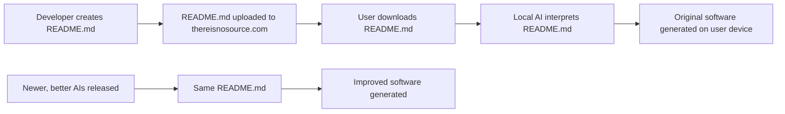
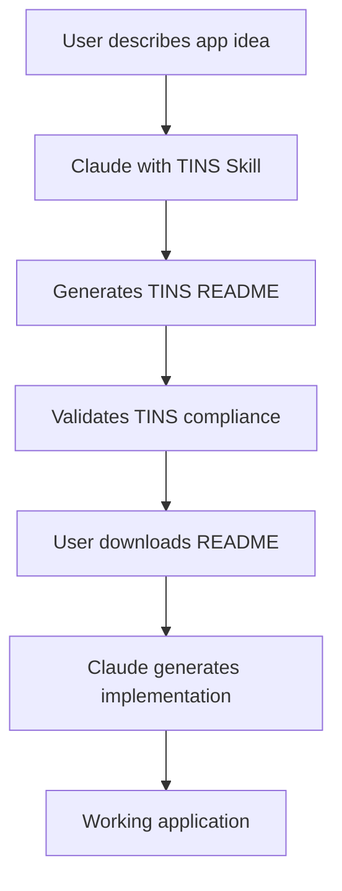

# TINS & Claude Skills

> **Two Approaches, One Goal: Instructing AI Through Structured Documentation**

[](https://opensource.org/licenses/MIT)
[](https://discord.com/invite/uubQXhwzkj)
[](https://x.com/MushroomFleet)

## 🌟 Overview

Welcome to the unified repository for **TINS** (There Is No Source) and **Claude Skills** – two complementary methodologies for instructing AI systems through natural language documentation. Whether you want to generate software implementations or define AI assistant behaviors, this repository provides the specifications, tools, and examples you need.

### What's Inside

- **Classic TINS System** – The original paradigm for AI-powered software distribution
- **Claude Skills Format** – System prompts for defining AI assistant capabilities
- **Comprehensive Documentation** – Specifications, best practices, and comparative analysis
- **Examples & Templates** – Ready-to-use examples for both formats
- **Tools & Utilities** – Helper tools for creating and validating documentation

## 🎯 Choose Your Path

### Path 1: TINS (Software Generation)

**Use TINS when you want AI to generate software applications.**

TINS is a revolutionary approach where you distribute only README files, and AI generates the actual software on demand:

- ✅ Distribute tiny README files instead of source code
- ✅ Software improves automatically as AI models advance
- ✅ Platform-independent implementations
- ✅ Enhanced security with no executable code distribution
- ✅ Focus on **what** the software should do

**Best for:** Web apps, mobile apps, CLI tools, games, data processing tools

[📖 TINS Documentation](#tins-classic-system) | [🚀 Quick Start](#getting-started-with-tins) | [📚 Examples](examples/)

---

### Path 2: Claude Skills (AI Behavior)

**Use Claude Skills when you want to define how AI assistants should behave.**

Claude Skills are structured system prompts that instruct Claude on specific capabilities, interaction patterns, and response behaviors:

- ✅ Define AI assistant personas and roles
- ✅ Specify interaction patterns and conversational flows
- ✅ Create domain-specific AI capabilities
- ✅ Ensure consistent AI behavior across sessions
- ✅ Focus on **how** the AI should behave

**Best for:** AI assistants, chatbot capabilities, specialized tools, AI-powered workflows

[📖 Skills Documentation](#claude-skills-system) | [🚀 Quick Start](#getting-started-with-claude-skills) | [🎨 Skills Gallery](skills/)

---

### Path 3: Both Together

**Combine both methodologies for maximum power.**

Create a Claude Skill that specializes in generating TINS-compliant software, or use TINS to describe AI-powered applications:

- 🔄 Skills can generate TINS READMEs
- 🔄 TINS can describe AI-powered software
- 🔄 Recursive capabilities for meta-development
- 🔄 Complete AI development ecosystem

[📖 Integration Guide](#integration-both-systems)

---

## 🆚 Format Comparison

Not sure which to use? Here's a quick comparison:

| Aspect | TINS | Claude Skills |
|--------|------|---------------|
| **Purpose** | Generate software | Define AI behavior |
| **Output** | Working applications | Conversational patterns |
| **Perspective** | "The application must..." | "You are..." |
| **Focus** | Product specifications | Interaction design |
| **Audience** | Any AI code generator | Claude/LLM assistants |
| **Examples** | Feature demos & UI mockups | User/AI dialogue pairs |

📄 **[Read the complete format comparison →](docs/Skills-vs-TINS.md)**

---

## 📘 TINS (Classic System)

### What is TINS?

TINS (There Is No Source) is a paradigm shift in software distribution:

1. **Only READMEs are distributed** – No source code is included in releases
2. **AI generates code on demand** – Software is reconstructed locally using AI
3. **Instructions evolve with technology** – Same README produces better code as AI improves
4. **Standardized format ensures consistency** – Structured approach to describing functionality

### How TINS Works



### TINS Benefits

- **📦 Tiny Distribution Size** – READMEs are orders of magnitude smaller than compiled code
- **🔄 Automatic Improvements** – Software naturally improves as AI technology advances
- **🔒 Enhanced Security** – No executable code distributed means fewer attack vectors
- **🛠️ Simplified Maintenance** – Focus on maintaining instructions, not implementation
- **🌐 Platform Independence** – Same README works across all platforms and architectures

### Getting Started with TINS

#### 1. Understand the TINS Specification

```markdown
# Project Title

## Description
[Overall description and purpose]

## Functionality
### Core Features
### User Interface
### User Flows

## Technical Implementation
### Architecture
### Data Model
### Components
```

📖 **[Full TINS Specification →](docs/tins/specification.md)**

#### 2. Create Your First TINS README

```bash
# Clone this repository
git clone https://github.com/YourOrg/tins-and-skills.git

# Check out the TINS examples
cd examples/tins/

# View the todo-app example
cat todo-app/README.md
```

#### 3. Generate Software from TINS

**Using TINS-MCP (Recommended):**
```bash
# Install the TINS-MCP server
npm install -g tins-mcp

# Generate code from README
tins-mcp generate ./my-app/README.md --output ./generated-app
```

**Using Claude with TINS Skill:**
1. Open Claude and load the TINS skill (see [Claude Skills](#claude-skills-system))
2. Upload your TINS README
3. Ask: "Generate the implementation for this TINS README"

📖 **[TINS Developer Guide →](docs/tins/developer-guide.md)**  
📖 **[TINS Best Practices →](docs/tins/best-practices.md)**

### TINS Examples

- **[Todo App](examples/tins/todo-app/)** – Task management application
- **[Calculator](examples/tins/simple-calculator/)** – Basic calculator with scientific functions
- **[API Wrapper](examples/tins/api-wrapper/)** – RESTful API client library
- **[Weather Dashboard](examples/tins/weather-dashboard/)** – Real-time weather visualization
- **[Note-Taking App](examples/tins/notes-app/)** – Markdown-based note editor

[📚 Browse all TINS examples →](examples/tins/)

---

## 🎨 Claude Skills System

### What are Claude Skills?

Claude Skills are structured system prompts that define specific capabilities and behaviors for Claude AI assistants. They enable you to:

- 🎭 Create specialized AI personas
- 🔧 Define domain-specific capabilities
- 💬 Specify interaction patterns
- ✅ Ensure consistent behavior
- 📋 Validate AI outputs

### How Claude Skills Work


### Claude Skills Benefits

- **🎯 Focused Expertise** – Create domain specialists (legal, medical, technical, etc.)
- **🔄 Reusable Behaviors** – Define once, use across many conversations
- **📐 Consistent Outputs** – Standardize how Claude responds and formats information
- **🧩 Modular Capabilities** – Mix and match skills for complex tasks
- **📚 Shareable Knowledge** – Distribute AI capabilities as documentation

### Getting Started with Claude Skills

#### 1. Understand the Skills Format

```markdown
# Skill Name - Claude Skill

## Role and Purpose
You are a [role description]...

## Core Capabilities
### 1. Capability Name
When a user [scenario], [action to take]...

## Example Interaction Patterns
### Pattern 1: Scenario Name
**User:** "[User input]"
**Response:** [Expected behavior]
```

📖 **[Skills Format Specification →](docs/skills/specification.md)**

#### 2. Load a Skill into Claude

**Option A: Via Claude.ai (Coming Soon)**
- Visit [Claude Skills Library](https://claude.ai/skills) *(link placeholder)*
- Browse and select a skill
- Click "Add to My Skills"
- The skill will be available in your Claude interface

**Option B: Manual Loading**
1. Copy the skill markdown document
2. Start a new Claude conversation
3. Paste the skill as context (or use Projects feature)
4. Claude will adopt the specified behavior

**Option C: API Integration**
```python
import anthropic

client = anthropic.Anthropic(api_key="your-api-key")

# Load skill content
with open("skills/tins-specialist.md", "r") as f:
    skill_prompt = f.read()

message = client.messages.create(
    model="claude-sonnet-4-20250514",
    max_tokens=1024,
    system=skill_prompt,  # Skill as system prompt
    messages=[
        {"role": "user", "content": "Your query here"}
    ]
)
```

📖 **[Skills Integration Guide →](docs/skills/integration-guide.md)**

#### 3. Create Your Own Skill

```bash
# Use the skill template
cp templates/skill-template.md my-custom-skill.md

# Edit with your specifications
vim my-custom-skill.md

# Test the skill with Claude
```

📖 **[Skill Creation Guide →](docs/skills/creation-guide.md)**  
📖 **[Skills Best Practices →](docs/skills/best-practices.md)**

### Claude Skills Gallery

- **[TINS Specialist](skills/tins-specialist.md)** – Expert in TINS README creation and validation
- **[Code Reviewer](skills/code-reviewer.md)** – Systematic code review and feedback
- **[Technical Writer](skills/technical-writer.md)** – Documentation creation and improvement
- **[API Designer](skills/api-designer.md)** – RESTful API design and specification
- **[Test Engineer](skills/test-engineer.md)** – Test case generation and validation
- **[Data Analyst](skills/data-analyst.md)** – Data exploration and visualization

[🎨 Browse all Skills →](skills/)

---

## 🔗 Integration (Both Systems)

### Use Case: AI-Powered Software Generator

Create a complete workflow where Claude Skills drive TINS generation:



**Example Workflow:**

1. **Load the TINS Specialist Skill**
   ```
   "I need help creating a TINS README for a habit tracker app"
   ```

2. **Claude generates comprehensive README**
   - Follows TINS specification
   - Includes all required sections
   - Provides detailed specifications

3. **Validate and refine**
   ```
   "Validate this README and suggest improvements"
   ```

4. **Generate implementation**
   ```
   "Now generate the code for this TINS README"
   ```

📖 **[Integration Examples →](docs/integration-examples.md)**

---

## 📁 Repository Structure

```
.
├── README.md                          # This file
├── docs/
│   ├── Skills-vs-TINS.md             # Format comparison analysis
│   ├── tins/
│   │   ├── specification.md          # TINS format specification
│   │   ├── developer-guide.md        # TINS development guide
│   │   └── best-practices.md         # TINS best practices
│   └── skills/
│       ├── specification.md          # Skills format specification
│       ├── integration-guide.md      # How to use skills
│       ├── creation-guide.md         # How to create skills
│       └── best-practices.md         # Skills best practices
├── examples/
│   ├── tins/
│   │   ├── todo-app/
│   │   ├── calculator/
│   │   ├── weather-dashboard/
│   │   └── ...
│   └── integration/
│       ├── skill-generates-tins/
│       └── tins-describes-ai-app/
├── skills/
│   ├── tins-specialist.md            # TINS expert skill
│   ├── code-reviewer.md
│   ├── technical-writer.md
│   └── ...
├── templates/
│   ├── tins-template.md              # TINS README template
│   └── skill-template.md             # Skill document template
└── tools/
    ├── tins-validator/               # TINS README validator
    └── skill-tester/                 # Skill behavior tester
```

---

## 🚀 Quick Start Guide

### For Software Developers (TINS)

```bash
# 1. Clone the repository
git clone https://github.com/YourOrg/tins-and-skills.git
cd tins-and-skills

# 2. Copy the TINS template
cp templates/tins-template.md my-app/README.md

# 3. Edit your README with app specifications
# Follow docs/tins/best-practices.md

# 4. Generate your application
# Option A: Use TINS-MCP
npm install -g tins-mcp
tins-mcp generate my-app/README.md

# Option B: Use Claude with TINS Skill
# Load skills/tins-specialist.md and upload your README
```

### For AI Capability Designers (Skills)

```bash
# 1. Clone the repository
git clone https://github.com/YourOrg/tins-and-skills.git
cd tins-and-skills

# 2. Copy the Skills template
cp templates/skill-template.md my-skill.md

# 3. Define your skill capabilities
# Follow docs/skills/creation-guide.md

# 4. Test your skill
# Load into Claude and test various interaction patterns

# 5. Share your skill
# Submit PR to add to skills/ directory
```

---

## 📚 Resources

### Documentation

- [Format Comparison: Skills vs TINS](docs/Skills-vs-TINS.md)
- [TINS Specification](docs/tins/specification.md)
- [TINS Developer Guide](docs/tins/developer-guide.md)
- [TINS Best Practices](docs/tins/best-practices.md)
- [Skills Specification](docs/skills/specification.md)
- [Skills Creation Guide](docs/skills/creation-guide.md)
- [Skills Best Practices](docs/skills/best-practices.md)

### Tools

- [TINS-MCP Server](https://github.com/ScuffedEpoch/TINS-MCP) – MCP server for TINS generation
- [TINS Validator](tools/tins-validator/) – Validate TINS README compliance
- [Skill Tester](tools/skill-tester/) – Test skill behavior patterns

### Community

- **[Discord Community](https://discord.com/invite/uubQXhwzkj)** – Join discussions, get help, share creations
- **[Twitter/X](https://x.com/MushroomFleet)** – Latest updates and announcements
- **[GitHub Discussions](https://github.com/YourOrg/tins-and-skills/discussions)** – Feature requests, Q&A, ideas

### Official Sites

- [thereisnosource.com](https://thereisnosource.com) – TINS official website
- [Claude Skills Library](https://claude.ai/skills) – Claude Skills directory *(coming soon)*

---

## 🤝 Contributing

We welcome contributions to both TINS and Claude Skills!

### How to Contribute

1. **Fork the repository**
2. **Create a feature branch** (`git checkout -b feature/amazing-skill`)
3. **Make your changes**
   - Add new TINS examples to `examples/tins/`
   - Add new Skills to `skills/`
   - Improve documentation in `docs/`
4. **Test your contribution**
   - Validate TINS READMEs with the validator
   - Test Skills with Claude
5. **Commit your changes** (`git commit -m 'Add amazing new skill'`)
6. **Push to the branch** (`git push origin feature/amazing-skill`)
7. **Open a Pull Request**

### Contribution Guidelines

- **TINS READMEs**: Must follow the [TINS Specification](docs/tins/specification.md)
- **Skills**: Must follow the [Skills Format](docs/skills/specification.md)
- **Documentation**: Clear, comprehensive, with examples
- **Code Quality**: Clean, well-commented, tested

📖 **[Full Contributing Guide →](CONTRIBUTING.md)**

---

## 📜 License

This project is licensed under the MIT License - see the [LICENSE](LICENSE) file for details.

### What This Means

- ✅ Free to use for personal and commercial projects
- ✅ Modify and distribute as needed
- ✅ Private use allowed
- ⚠️ No warranty provided
- ⚠️ Must include original license and copyright

---

## 🙏 Acknowledgments

### TINS System

- Created by the [ScuffedEpoch](https://github.com/ScuffedEpoch) team
- Original concept from [thereisnosource.com](https://thereisnosource.com)
- Community contributors and early adopters

### Claude Skills

- Inspired by Claude's capabilities and system prompt design
- Built on principles of structured AI instruction
- Community feedback and skill contributions

### Special Thanks

- All contributors who have submitted TINS examples and Skills
- The AI research community for advancing LLM capabilities
- Early testers and feedback providers
- Discord community members

---

## 📊 Project Stats


---

## 🗺️ Roadmap

### Q1 2025

- [x] Launch unified repository
- [x] Complete comparative analysis
- [ ] Release TINS 2.0 specification
- [ ] Launch Claude Skills official directory
- [ ] Release VS Code extensions for both formats

### Q2 2025

- [ ] TINS-MCP 2.0 with enhanced generation
- [ ] Skills validation and testing framework
- [ ] Web-based TINS README builder
- [ ] Skills marketplace integration

### Q3 2025

- [ ] Multi-language support for TINS generation
- [ ] Advanced Skills composition system
- [ ] Automated testing for both formats
- [ ] Integration with popular AI platforms

### Future

- [ ] TINS binary distribution format
- [ ] Skills certification program
- [ ] Enterprise support packages
- [ ] Educational curriculum and courses

---

## 📞 Contact & Support

### Get Help

- **Documentation**: Check [docs/](docs/) first
- **Discord**: Join our [community server](https://discord.com/invite/uubQXhwzkj)
- **GitHub Issues**: [Report bugs or request features](https://github.com/YourOrg/tins-and-skills/issues)
- **Email**: support@thereisnosource.com

### Follow Us

- **Twitter/X**: [@MushroomFleet](https://x.com/MushroomFleet)
- **GitHub**: [@ScuffedEpoch](https://github.com/ScuffedEpoch)
- **Website**: [thereisnosource.com](https://thereisnosource.com)

---

## 📚 Citation

### Academic Citation

If you use this codebase in your research or project, please cite:

```bibtex
@software{tins_for_skills,
  title = {TINS for Skills: Using TINS with Claude Skill.md},
  author = {[Drift Johnson]},
  year = {2025},
  url = {https://github.com/MushroomFleet/TINS-for-Skills},
  version = {1.0.0}
}
```

### Donate:

[](https://ko-fi.com/driftjohnson)


<div align="center">

**Made with ❤️ by the TINS & Claude Skills Community**

[⭐ Star this repo](https://github.com/YourOrg/tins-and-skills) | [🐦 Share on Twitter](https://twitter.com/intent/tweet?text=Check%20out%20TINS%20%26%20Claude%20Skills!) | [💬 Join Discord](https://discord.com/invite/uubQXhwzkj)

</di
