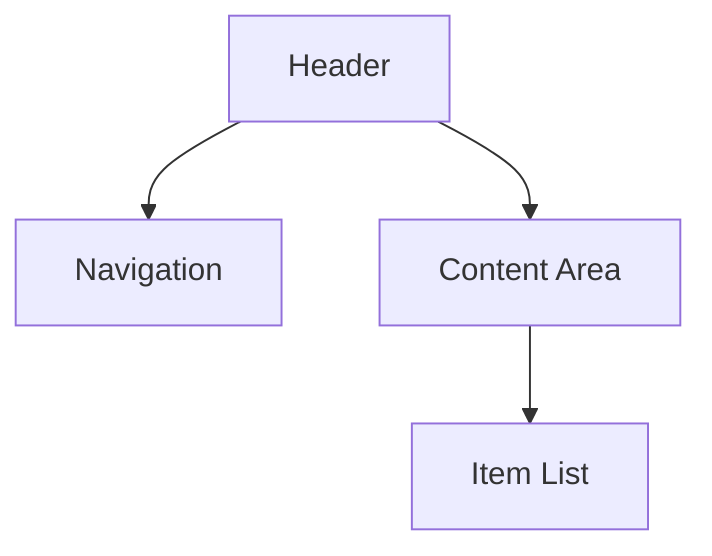

# Skills vs TINS: A Comparative Analysis of AI Instruction Formats

## Executive Summary

Claude Skills (system prompts) and TINS (There Is No Source) represent two parallel approaches to instructing AI systems through natural language documentation. While both achieve the same fundamental goal—providing structured instructions that AI can interpret and act upon—they differ significantly in their structural conventions, narrative perspective, and intended output. This document analyzes the key differences between these formats from a document structure perspective.

## Fundamental Similarity

Both formats share a core principle: **detailed markdown documentation that AI systems interpret to produce specific outcomes**. Whether generating behavior patterns (Skills) or software implementations (TINS), both rely on:

- Comprehensive written specifications
- Structured markdown formatting
- Clear hierarchical organization
- Explicit rather than implicit instructions
- Examples and concrete illustrations

## Key Structural Differences

### 1. Document Header and Identity

**Claude Skills:**
```markdown
# [Skill Name] - Claude Skill

## Role and Purpose
You are a [role description]...
```

**TINS:**
```markdown
# [Project Name]

## Description
[Project description]...
```

**Analysis:**
- Skills explicitly identify themselves as "Claude Skill" in the title
- Skills include a dedicated "Role and Purpose" section
- TINS uses a more generic "Description" section
- Skills immediately establish AI persona; TINS describes software purpose

### 2. Narrative Perspective

**Claude Skills:**
- Written in **second person** ("You are...", "Your role is...", "When you...")
- Instructions directed **at the AI**
- Meta-conversational (describes how to interact)
- Example: "You are a TINS specialist assistant"

**TINS:**
- Written in **third person** or **declarative** ("The application must...", "Users can...")
- Instructions describe **the software product**
- User-focused (describes end-user experience)
- Example: "The application must validate that the email field contains..."

**Impact:**
This is the most fundamental structural difference. Skills are **reflexive** (AI reflecting on its own behavior), while TINS is **projective** (AI projecting a separate artifact).

### 3. Core Section Structure

#### Claude Skills Standard Sections:

```markdown
# Skill Name - Claude Skill

## Role and Purpose
## Core Capabilities
## [Domain] Guidelines
## Best Practices
## Example Interaction Patterns
## Special Considerations
## Quality Standards
## Error Handling
## Output Format
```

#### TINS Standard Sections:

```markdown
# Project Name

## Description
## Functionality
  ### Core Features
  ### User Interface
  ### Behavior Specifications
## Technical Implementation
  ### Architecture
  ### Data Structures
  ### Algorithms
## Style Guide
## Testing Scenarios
## Accessibility Requirements
## Performance Goals
```

**Analysis:**
- Skills emphasize **AI behavior patterns** and **interaction modes**
- TINS emphasizes **software features** and **technical specifications**
- Skills include "Example Interaction Patterns" (meta-level)
- TINS includes "User Interface" and "Data Structures" (implementation-level)

### 4. Instruction Framing

**Claude Skills:**
```markdown
## Core Capabilities

### 1. [Capability Name]
When a user [scenario], [action to take]:
- [Specific behavior 1]
- [Specific behavior 2]
```

**TINS:**
```markdown
## Functionality

### [Feature Name]
The application should:
- [Feature capability 1]
- [Feature capability 2]
```

**Analysis:**
- Skills use **conditional framing** ("When...then...")
- TINS uses **declarative framing** ("The application should...")
- Skills focus on **conversational triggers**
- TINS focuses on **functional requirements**

### 5. Example Usage

**Claude Skills - Interaction Patterns:**
```markdown
## Example Interaction Patterns

### Pattern 1: [Scenario Name]
**User:** "[User input]"
**Response:** [How to respond and what to generate]

### Pattern 2: [Another Scenario]
**User:** "[User input]"
**Response:** [Expected behavior]
```

**TINS - Feature Examples:**
```markdown
### [Feature Name]
The search function should support filtering by multiple criteria:
- Single property: `search("name:John")`
- Multiple properties: `search("name:John role:admin")`
- Range values: `search("age:30-40")`
```

**Analysis:**
- Skills show **conversational exchanges** (user input → AI response)
- TINS shows **functional examples** (input → output behavior)
- Skills are **dialogic** in nature
- TINS is **operational** in nature

### 6. Validation and Quality Control

**Claude Skills:**
```markdown
## Quality Standards

Generated implementations must be:
- **Complete** - All features implemented
- **Functional** - Actually works as described
- **Clean** - Well-organized and readable

## Validation Checklist
When validating [output], check:
- [ ] Has clear [requirement]
- [ ] Details all [aspects]
```

**TINS:**
```markdown
## Testing Scenarios
[List of test cases that the implementation should satisfy]

## Performance Goals
- Initial load under 2 seconds
- Smooth animations (60fps)
- Responsive to input with no perceptible lag
```

**Analysis:**
- Skills focus on **AI output quality** (how the AI should produce results)
- TINS focuses on **software quality** (what the software should achieve)
- Skills include **meta-validation** (AI checking its own work)
- TINS includes **product validation** (software meeting requirements)

### 7. Technical Specification Depth

**Claude Skills:**
```markdown
## Code Generation Guidelines

When generating code from [source]:
1. **Read Comprehensively** - Understand all sections before coding
2. **Match Specifications Exactly** - Implement precisely what's described
3. **Choose Appropriate Technologies** - Unless specified, select modern tech
```

**TINS:**
```markdown
## Technical Implementation

### Data Model
Each task should be represented as an object with:

```javascript
{
  id: string,           // Unique identifier
  title: string,        // Task name
  completed: boolean,   // Completion status
  priority: "low" | "medium" | "high"
}
```

### Storage
- Use local storage for persistent data
- Implement data synchronization if offline capability required
```

**Analysis:**
- Skills provide **process guidance** (how to approach implementation)
- TINS provides **concrete specifications** (what to implement)
- Skills are **methodology-focused**
- TINS is **implementation-focused**

### 8. Diagrams and Visual Aids

**Claude Skills:**
```markdown
### Diagrams and Visual Aids
Use Mermaid syntax for:
- Architecture diagrams
- User flow charts
- State machines
```

**TINS:**
```markdown
### User Interface Layout


```

**Analysis:**
- Skills **describe when to use** diagrams (meta-instruction)
- TINS **includes actual** diagrams (concrete specification)
- Skills instruct on diagram usage
- TINS demonstrates through example

### 9. Error Handling Approach

**Claude Skills:**
```markdown
## Error Handling

When encountering issues:
- **Incomplete README:** Ask for missing information
- **Contradictions:** Point out conflicts and ask for clarification
- **Ambiguities:** Request more specific details
```

**TINS:**
```markdown
## Behavior Specifications

### Error States
When a user attempts to delete an account:
1. The system should prompt for confirmation
2. If confirmed, mark the account as deactivated but retain data for 30 days
3. Send a confirmation email with an option to restore the account
```

**Analysis:**
- Skills describe **AI error recovery** (what to do when confused)
- TINS describes **software error handling** (what software should do)
- Skills handle **document ambiguity**
- TINS handles **runtime errors**

### 10. Metadata and Annotations

**Claude Skills:**
```markdown
## Special Considerations

### Platform-Specific Requirements
When creating [outputs], consider target platform:
- **Web:** Browser compatibility, responsive design
- **Mobile:** Touch interactions, offline capability
```

**TINS:**
```markdown
<!-- ZS:COMPLEXITY:MEDIUM -->
<!-- ZS:PRIORITY:HIGH -->
<!-- ZS:PLATFORM:WEB -->
<!-- ZS:LANGUAGE:JAVASCRIPT -->
```

**Analysis:**
- Skills use **prose guidelines** for platform considerations
- TINS uses **structured metadata tags**
- Skills are **descriptive**
- TINS is **declarative** with parseable metadata

## Convergence Points

Despite these differences, the formats converge in several areas:

### 1. Markdown as Foundation
Both use standard markdown with:
- Hierarchical headers (H1, H2, H3...)
- Code blocks with syntax highlighting
- Lists (ordered and unordered)
- Emphasis (bold, italic)

### 2. Explicitness Over Implicitness
Both emphasize:
- Clear, detailed instructions
- Concrete examples
- Specific rather than vague language
- Comprehensive coverage of scenarios

### 3. Structured Organization
Both require:
- Logical section hierarchy
- Consistent terminology
- Progressive detail (general → specific)
- Clear relationships between sections

### 4. Self-Containment
Both demand:
- No external dependencies
- Complete information within document
- No assumptions about prior knowledge
- All necessary context included

## Functional Equivalence Despite Structural Differences

The key insight is that **both formats instruct AI systems to produce specific outputs**, but they differ in **what** is being produced:

| Aspect | Claude Skills | TINS |
|--------|---------------|------|
| **Output Target** | AI behavior patterns | Software implementations |
| **Document Voice** | Second person (to AI) | Third person (about software) |
| **Primary Focus** | Conversational patterns | Functional requirements |
| **Validation** | AI response quality | Software functionality |
| **Examples** | User-AI dialogues | Software feature demos |
| **Audience** | The AI system itself | Human developers & AI generators |

## Integration Opportunities

The formats can be integrated because:

1. **Skills can generate TINS-compliant READMEs**
   - A Skill instructs Claude how to create proper TINS documentation
   - The output is a TINS README that another AI can implement

2. **TINS can be a Skill domain**
   - "TINS specialist" becomes a Claude Skill
   - The Skill knows how to read TINS and generate code

3. **Recursive application possible**
   - Skill creates TINS README
   - TINS README creates software
   - Software includes AI capabilities described by Skills

## Structural Format Comparison Table

| Element | Claude Skills | TINS |
|---------|---------------|------|
| **Document Title Format** | `# [Name] - Claude Skill` | `# [Project Name]` |
| **Opening Section** | Role and Purpose | Description |
| **Perspective** | You are... (reflexive) | The application... (projective) |
| **Primary Sections** | Capabilities, Guidelines, Patterns | Functionality, Implementation, Testing |
| **Example Format** | User/Response pairs | Feature demonstrations |
| **Validation Focus** | AI behavior correctness | Software quality metrics |
| **Technical Detail** | Process and approach | Concrete specifications |
| **Error Handling** | Document interpretation issues | Software runtime errors |
| **Metadata** | Prose guidelines | Structured tags |
| **Diagram Purpose** | Illustrate AI decision trees | Illustrate UI/architecture |

## Recommendations for Format Selection

### Use Claude Skills When:
- Defining AI assistant behavior
- Creating conversational capabilities
- Specifying interaction patterns
- Building AI-powered tools where the AI is the product
- Need to control how AI interprets and responds

### Use TINS When:
- Defining software to be generated
- Creating user-facing applications
- Specifying concrete implementations
- Building tools where AI is the builder, not the product
- Need to control what AI generates

### Use Both When:
- Creating AI systems that generate software
- Building meta-tools (AI that creates AI-generated software)
- Developing comprehensive AI capabilities with specific output artifacts

## Conclusion

Claude Skills and TINS represent two sides of the same coin: **instructing AI through structured natural language**. The primary structural difference lies in **narrative perspective**—Skills speak **to** the AI about its behavior, while TINS speaks **through** the AI about software it should create.

The addition of "Claude Skill" to the header, as noted, is indeed the most visible marker of this distinction. However, the deeper structural differences—perspective, section organization, example formats, and validation approaches—reflect the fundamental difference in purpose: **behavioral instruction vs. implementation specification**.

Both formats demonstrate that AI systems can be effectively programmed through well-structured natural language documentation, marking a significant evolution in how we think about software development and AI interaction. The integration of these approaches represents a powerful paradigm where AI systems can both **behave according to specifications** (Skills) and **generate according to specifications** (TINS), creating a complete ecosystem for AI-driven software development.

---

**Document Version:** 1.0  
**Date:** October 18, 2025  
**Format Comparison:** Claude Skills (System Prompts) vs TINS (There Is No Source)
